# `clock_zoo` — LC vs PTC identifiability across simpler clock models

*Semi-README scientific reference. Update it with every result. Figures live in
`docs/figures/`, copied out of the git-ignored `out/`, so they travel with this document.*

---

## 0. TL;DR

**Question (unchanged from `../input_screen/`).** Does phase-transition-curve (PTC) data make a
mechanistic circadian model more identifiable than limit-cycle (LC) data alone?

**Why a new repo.** Three weeks on **Mirsky 2009** (21 states, 132 params) established the
machinery and several robust phenomenological results, but the optimisation never worked:
gradient descent recovers 132/132 parameters *from the truth* and stalls at ~26/132 *from a
distance*. That "from-distance locality" blocked the actual scientific question. So: change
the model, not the optimizer, and re-ask it on models small enough to optimise.

**Status.** The stack is built and gated. Objectives (a) and (b) are answered for Almeida,
across three perturbation targets (BMAL1, CRY, PER). The first cluster campaigns have run --
20 radialization searches, ~550 CPU-hours (§5.10) -- and their outcome is a finding about the
OBJECTIVE rather than about the search: the landscape is genuinely multimodal (12 usable
solutions within 1.6x in cost, a median of 9.89 apart in a box of radius 3), and the cost
reduction they achieved lies almost entirely in the part of the dose window where the radial
target carries no phase information. Read §5.10c and hazard 17 before quoting any `c_ptc` from
a radial fit. §5.11 then answers the follow-up -- the flat surfaces are mostly
HEALTHY clocks whose S_crit collapsed three to four decades below the fit window, though 3 of
the 12 sit on orbits the system does not stay on.

**The headline scientific result so far:** for Almeida at base, there IS a parameter
combination that the PTC constrains and the limit cycle leaves ~11x freer -- confirmed by
finite displacement on an independent adaptive solver, with controls (§3.6). No single
parameter shows this (best ratio 1.04); it only appears in a COMBINATION, which is why a
per-parameter sensitivity scatter misses it entirely. This is the opposite of the Mirsky
result, where no direction decoupled. The clean probes (BMAL1, DBP) find the SAME direction
(`ker`/`gamma_CP`/`ve`/`ke`), so it looks like a property of the model rather than of the probe
-- but see 3.7: the CRY and PER surfaces turned out to be phase-scrambled and their numbers are
retracted, so this rests on two probes, not four.

The most consequential methodological findings, each of which changed a scientific answer:

- **Almeida's PTC type-transition dose is a property of the integrator step until you refine
  it.** At `dt=0.02`, 3 of 8 targets appeared to reset; refined, **7 of 8 do**.
- **A converged periodic-orbit solve is not necessarily a limit cycle.** Equilibria and
  negative-orthant runaways both satisfy the BVP, and both produced spectacular-looking
  "sensitivities" (5e98, 1e11) before being caught.
- **Almeida is far less gauge-degenerate than Mirsky** — 2 flat directions of 18, versus 13 of
  132 — so its identifiability question is essentially unconfounded by units.
- **A jacobian ratio overstates decoupling.** The linear analysis predicted ~140x for the
  direction above; a finite displacement gives 11x. The ordering survives, the magnitude does
  not — so the finite-displacement number is the one to quote.

---

## 1. The models

All three were taken from `../circadian_modeling.ipynb`, ported unchanged (verified against
the notebook's own `derivatives`), and all oscillate self-sustainedly at their published
parameters, so **no re-fit was needed** before characterization.

| model | states | params | period | structure | Floquet mu | gauge |
|---|---|---|---|---|---|---|
| **Goodwin/Gonze** | 3 | 11 | 23.540 h | single negative loop, Michaelian degradation | 0.951 | 4 |
| **Almeida 2020** | 8 | 18 | 24.826 h | transcription-factor level; EBOX/RRE/DBOX; one reversible complex | 0.546 | 2 |
| **Korencic/Grabe** | 15 | 34 | 25.809 h | 5 genes x a 3-stage delay chain; no complexes | 0.505 | 1 |
| **Leloup–Goldbeter 2003** | 16 | 52 | 23.849 h | phosphorylation + nuclear transport + MM degradation | 0.334 | 5 |
| *(Mirsky 2009, for scale)* | *21* | *132* | *23.7 h* | *mass-action dimers* | — | *13* |

Goodwin is a **smoke test, not a science target**: it is the smallest thing that oscillates and
its gauge is known-good from `input_screen`, so it validates every tool before that tool
touches a model whose answer we do not already know.

**Four Goldbeter parameters were dropped.** `V1PCP`, `V1BP`, `V2PCP`, `V2BP` appear in the
notebook's parameter dict but in none of its 16 equations — verified numerically: perturbing
each leaves the RHS bit-identical. Keeping them would contribute four guaranteed-flat
directions to every identifiability count, inflating precisely the quantity being measured.

### 1.1 The perturbation

Two generic modes, defined for any state of any model: **pulse** (an additive production rate
`+dose` for 8 h, then off) and **instant** (a one-shot displacement, clamped at 0). No ectopic
protein, no degron, no complex bookkeeping. This is the notebook's own
`AdditiveRatePerturbation`, so PRCs stay comparable with what is already there, and it is the
only definition that maps onto Korencic, which has no protein species at all.

---

## 2. The gauge: how much of each model is even meaningful

Rescaling a species — measuring it in different units — is an exact symmetry absorbed into the
parameters, so any observable that does not fix the concentration units is blind to it. The
generators are **derived** from each model's declared dimensions and then **verified**, not
asserted: the defining identity `f(S y; theta_gauged) = rho . S . f(y; theta)` is checked
pointwise, with no integration to hide behind.

| model | generators | of params | physically meaningful | identity |
|---|---|---|---|---|
| almeida | 2 | 18 | **16** | 1.3e-13 |
| korencic | 1 | 34 | **33** | 6.3e-15 |
| goldbeter | 5 | 52 | **47** | 1.6e-15 |
| goodwin | 4 | 11 | 7 | 3.6e-16 |

**Almeida's 2 generators are forced by its shared promoter terms.** `EBOX` is added to five
different species' equations, `RRE` to four, and the PER/CRY binding and BMAL1 titration terms
chain the rest — so *all eight species share one concentration unit*, leaving one scale factor
plus time. There is no per-species freedom at all.

**Korencic needed a new piece of contract.** Its transcription is a bare product of Hill
factors with **no maximal-rate parameter**, so nothing can absorb a rescaling of a transcript.
That is not expressible as "these species share a unit", so `models/api.py` gained
`scale_constraints()`: linear relations the log scales must satisfy. Korencic declares three
per gene, which pin every species scale to the single time rescale (its derived factors come
out as exactly `rho^-1, rho^-2, rho^-3` along each chain). **One generator for 34 parameters.**

The practical consequence: unlike Mirsky, these models' identifiability questions are almost
entirely unconfounded by units — but the gauge must still be projected out before any
parameter-space comparison, because a gauge direction is exactly LC-null while moving a
fixed-absolute-dose PTC, which is precisely the false signal `analysis/coupling.py` hunts for.

---

## 3. Results

### 3.1 Objective (a): which components reset the clock, and where

`analysis/scrit.py`, Almeida, pulse mode. **S_crit is the dose of the type-1 → type-0 winding
transition.** This is the canonical table — do not recompute it.

| target | S_crit | dt-converged | re-entrant | valid to | dt needed |
|---|---|---|---|---|---|
| DBP | **0.196** | yes | yes | 1e4 | 0.005 |
| BMAL1 | **3.16** | yes | no | 22.1 (unstable) | 0.005 |
| PER_CRY | **5.51** | yes | no | 117 (unstable) | 0.00125 |
| PER | **16.8** | yes | no | 1e4 | 0.00125 |
| CRY | **29.2** | yes | yes | 1e4 | 0.00125 |
| REV | **29.2** | yes | yes | 1e4 | 0.00125 |
| E4BP4 | **50.9** | yes | no | 1e4 | 0.00125 |
| ROR | — | — | — | 1e4 | 0.005 |

**Seven of eight Almeida targets reset.** ROR is the sole non-resetter, and credibly so: it
was scanned to the top of the range (1e4) without the integrator going unstable, so this is a
statement about the model rather than about where the numerics gave up.

> **This table required refining `dt`, and that changed the answer.** The dose at which
> fixed-step RK4 goes unstable is a property of the STEP, not the model, and it moves ~8x per
> 4x smaller step. At `dt=0.02` the ceiling for CRY is 6.2 and CRY appears not to reset at
> all; at `dt=0.005` the ceiling is 48.6 and CRY resets at 32.2; `dt=0.00125` confirms 32.2.
> A single default step would have produced the clean, plausible, **wrong** claim that 5 of
> Almeida's 8 targets are non-resetting.

**Contrast with Mirsky.** There the rule was sharp and structural: only the repressor arm
resets; BMAL1/CLK/RORa are dose-flat with no singularity even at 500x peak. Almeida shows no
such arm asymmetry — BMAL1 is among its *strongest* resetters (S_crit 3.16). Whether that is a
real difference in clock architecture or a consequence of Almeida's single shared scale group
is an open question, and Korencic/Goldbeter are the next data points.

### 3.2 The base PTC surfaces

`analysis/characterize.py` on the adaptive grids.

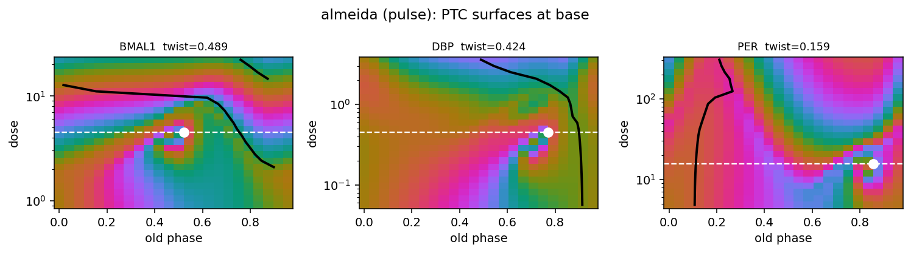

| target | S* | phi* | total twist | singularities | min rel. amplitude |
|---|---|---|---|---|---|
| DBP | 0.452 | 0.771 | **0.424 cyc** | 1 | 1.000 |
| BMAL1 | 4.503 | 0.521 | **0.489 cyc** | 1 | 1.000 |
| PER | 15.65 | 0.854 | **0.159 cyc** | 1 | 1.000 |

Each surface shows exactly **one** dipole-filtered singularity — a clean type-1 → type-0
transition, textbook pinwheel structure, the S_crit line passing through the defect. Two
things worth noting:

- **The clock is never even weakened** (minimum relative amplitude 1.000 across every grid
  point). Almeida's oscillation is robust to these perturbations in a way Goodwin's is not —
  an 8 h pulse of dose 0.5 into Goodwin's X drives Z high enough that its n=4 Hill shuts
  transcription down ~1e-5 and the oscillator stops **permanently**.
- **Isochron twist is substantial** — 0.42–0.49 cyc for DBP and BMAL1, i.e. the entrainment
  phase shears by nearly half a cycle across the dose range. Twist is the smooth,
  gauge-invariant feature and is what any isochron claim should be read from; `S*`/`phi*` are
  topological defects and are grid-quantised.

*(S* here is 4.503 for BMAL1 against `scrit`'s 3.16 — the two use different dose grids, so
this is grid resolution, not a discrepancy.)*

### 3.3 Objective (b), part 1: LC sensitivity

`analysis/lc_sens.py`, Almeida, 18 parameters x 9 factors (x0.25 – x4).

Top movers: `vd` 0.659, `vr` 0.605, `gamma_DB` 0.604, `gamma_REV` 0.589, `krr` 0.462.
Least: `ker` 0.196, `gamma_BP` 0.219, `gamma_CP` 0.269.

**The striking feature is the RANGE: 0.20 to 0.66, a factor of 3.3.** For Mirsky the
equivalent span was ~50x, with a long sloppy tail. Almeida has **no sloppy parameters in the
single-parameter sense** — every one of its 18 parameters moves the limit cycle by a
comparable amount. That is a genuinely favourable property for identifiability and a direct
consequence of choosing a small model.

*Caveat, stated plainly:* 51 of 162 settings were rejected (6 dead, 11 negative-orthant, 34
non-converged). The rejections concentrate at large displacements, so the reported spans are
mild **under**-estimates. The 34 non-converged are a known limitation of the orbit guess, not
a claim that no orbit exists there.

### 3.4 Objective (b), parts 2–3: PTC sensitivity and the coupling

`analysis/ptc_sens.py` on Almeida / BMAL1 (pulse), 18 parameters x 9 factors on the fixed base
dose grid 0.912–22.1. Ranked by twist response: `vd` 0.375, `gamma_c` 0.340, `vr` 0.321,
`ke` 0.295, `gamma_P` 0.288. As with the LC, the range is narrow — 0.24 to 0.37.

`analysis/coupling.py`, the gauge quotiented out (2 of 15 usable parameters), J_LC = 513
observables x 15 parameters, J_PTC = 576 x 15.


**Preliminary, and it points the opposite way to Mirsky — but read the caveats.**

| | Mirsky (input_screen) | Almeida (here) |
|---|---|---|
| per-parameter log-log correlation | tight | **+0.660** (moderate) |
| the low-LC / high-PTC quadrant | **empty** | 4 of 18 parameters |
| angle between the single best-determined LC and PTC combination | — | **79.1 deg** |
| LC-sloppiest directions' share of PTC response | 3.4% (pointwise) / 0.5% (twist) | **7.7%** |

The clearest signal is the **79.1 deg** between the leading LC direction and the leading PTC
direction: the combination the limit cycle pins hardest and the one the PTC pins hardest are
nearly orthogonal. The next few are more shared (k=3: 14, 39, 84 deg; k=5: 9, 22, 45, 77, 81),
so the two experiments overlap substantially but each retains directions the other is close to
blind to. Consistently, the PTC response is **not monotone in LC sensitivity** — the 2nd LC
direction carries the largest PTC response (1.000) while the 1st carries 0.375.

**What this does not yet establish.** Three things, stated plainly:

1. **The quadrant count is weak evidence.** Every parameter sits within a ~3x band on both
   axes (see the figure), so the quadrant split is a median cut through a tight cluster, not
   an order-of-magnitude separation like Mirsky's. "4 in the prize quadrant" should not be
   read as "4 decoupled parameters".
2. **The candidate direction has now been confirmed — see §3.6.**
3. **3 of 18 parameters were dropped**, lacking a converged orbit at both difference factors.

**One thing that IS solid**: after the gauge projection, the two exactly-null directions of
J_LC are also exactly null in J_PTC (3.5e-16). That is the correct, self-consistent behaviour
and confirms the projection is doing what it should rather than leaking a false signal.

#### What the sensitivity numbers actually look like

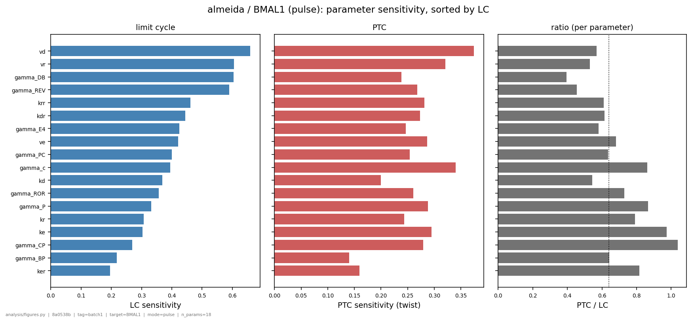

LC sensitivity decays smoothly from 0.66 (`vd`) to 0.20 (`ker`); the PTC response is FLATTER,
0.37 to 0.14. The third panel is the per-parameter ratio, and its ceiling is the point: the
best single parameter reaches only **1.04**, so no individual parameter is meaningfully
decoupled.

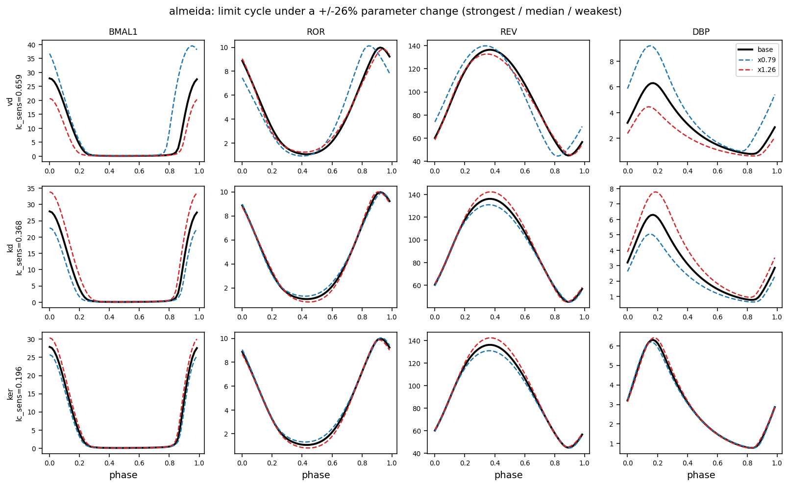
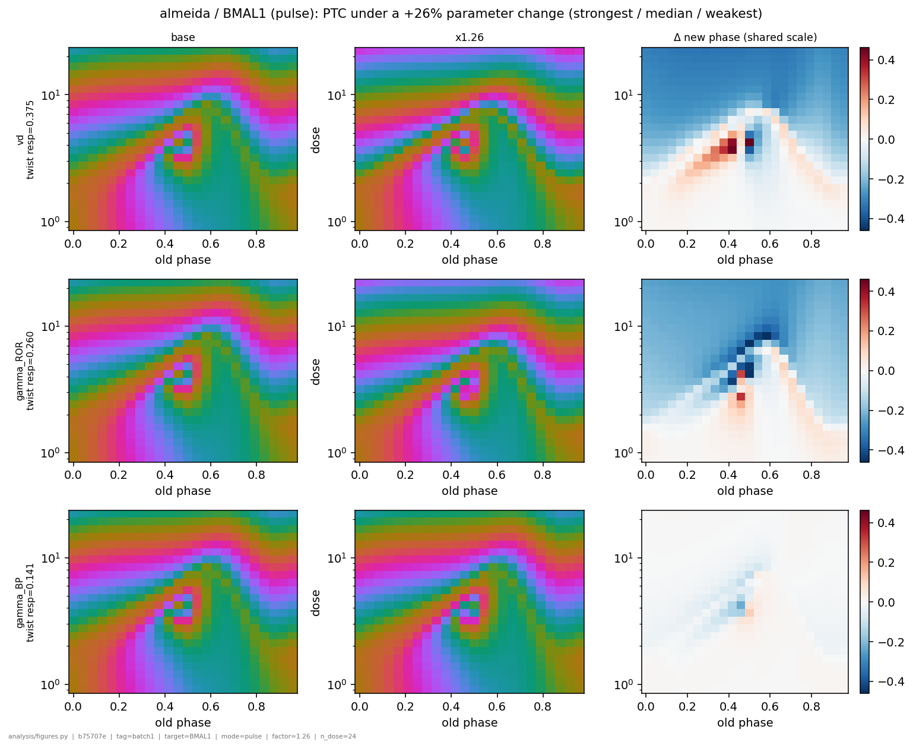

A `lc_sens` of 0.66 (`vd`) is a visible ~40% change in BMAL1's peak and ~50% in DBP's; 0.20
(`ker`) barely moves the cycle at all. On the PTC side the **Δ new-phase** panel is what makes
a change legible — raw before/after surfaces look nearly identical, while the difference shows
`vd` displacing the singularity as a red/blue dipole plus a broad high-dose band, and the
weakest parameter as a faint local smudge.

### 3.5 The decoupling is COMBINATORIAL, and only combinations show it

A per-parameter scatter can only find decoupling that happens to be **axis-aligned**. A
decoupled direction is generically a combination, so the right question is: which unit
direction `v` in log-parameter space maximises

    rho(v) = ||J_PTC v||^2 / ||J_LC v||^2

which is the generalized eigenproblem `(J_PTC^T J_PTC) v = rho (J_LC^T J_LC) v`.

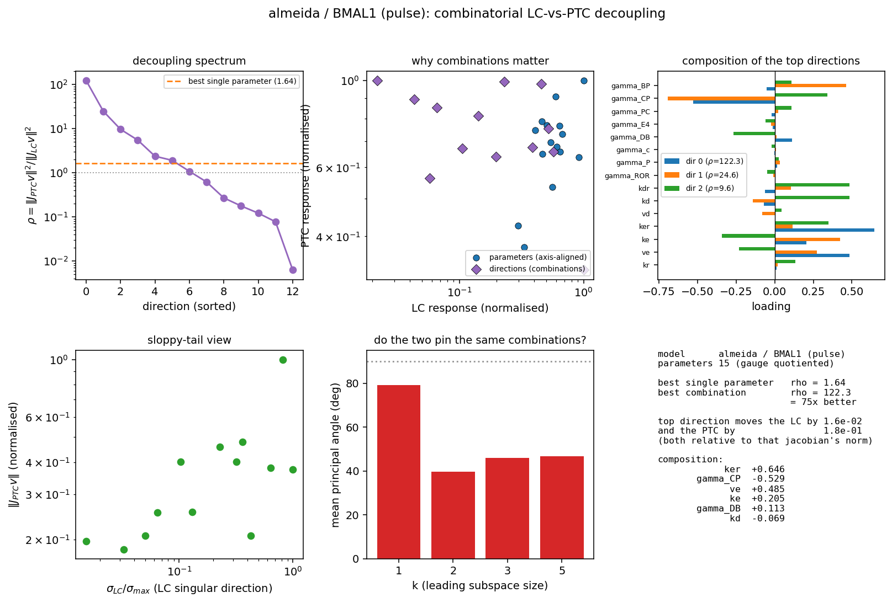

| | rho |
|---|---|
| best single parameter (`ve`) | **1.64** |
| best combination | **122.3** |
| gain | **75x** |

The top direction is `0.65 ker − 0.53 gamma_CP + 0.49 ve + 0.21 ke + 0.11 gamma_DB`. It moves
the limit cycle by **1.6e-02** and the PTC by **1.8e-01** of their respective jacobian norms.

**This is not a ridge artifact, and it was checked rather than assumed.** rho blows up wherever
the denominator is small, so the top eigenvector will happily be a direction the LC jacobian
cannot RESOLVE rather than one the limit cycle genuinely does not move — a different claim, and
only the second is a result. Two checks:

- The LC jacobian's finite-difference noise floor is ~1e-5 relative (the orbit solves to
  |F| ~ 1e-13 but the cycle is accurate to ~5e-6). The top direction's LC response is
  **1.6e-02**, three orders above it.
- Sweeping the LC singular-value floor from 1e-10 to 1e-2, rho_max stays at **122.3** with the
  same composition, and only falls to 37 at 3e-2 when a 13th direction is cut. A ridge artifact
  would collapse as the floor rose.

So Almeida does have a genuinely decoupled direction — **and no single parameter comes close to
it**. This is the concrete reason the per-parameter scatter in §3.4 under-reports, and it
sharpens the contrast with Mirsky, where the equivalent search was done over `J_LC`'s singular
directions rather than as an extremal problem.

### 3.6 CONFIRMED by finite displacement — and the magnitude is NOT

`analysis/confirm.py`: step a finite `eps = 0.15` in log-parameter space along each direction,
recompute the limit cycle on the orbit solver and the PTC on **`engine/reference.py`, the
independent adaptive engine** that shares no numerical machinery with the JAX engine the
jacobian came from. Both signs, three directions, 12 phases x 3 doses.

| direction | rho | dLC | dPTC (rms) | dPTC (max) | **actual PTC per LC** |
|---|---|---|---|---|---|
| **decoupled** (candidate) | 122.3 | **0.0017** | **0.0303** | 0.052 | **18.1** |
| **coupled** (control) | 0.01 | 0.0725 | 0.1182 | 0.42 | **1.64** |
| **stiffest LC** (positive control) | — | 0.1077 | 0.1325 | 0.46 | 1.23 |

**The ordering is real.** The candidate direction moves the limit cycle by 0.17% while moving
the PTC by 3.0% rms — an actual PTC-per-LC ratio **11x** that of the coupled control. The
positive control moves both, so the measurement is working rather than reporting noise; and the
two signs agree closely (0.0300 / 0.0305), so this is not a one-sided artifact of the step.

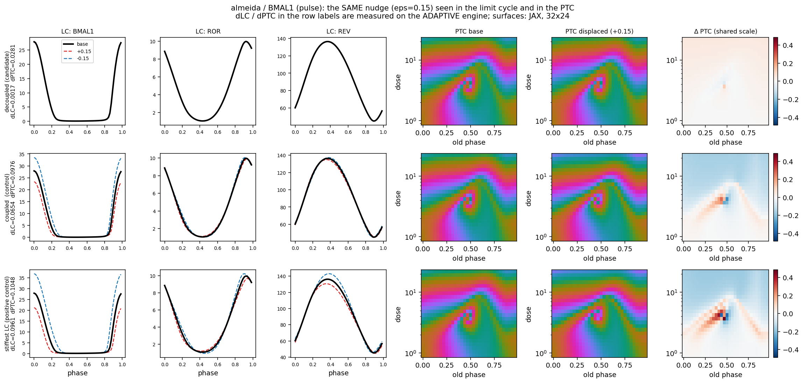

**Read that figure carefully, because it does not say what a quick glance suggests.** In row 1
the dashed +/-eps cycles are invisible under the black base curve, and the PTC Delta is a small
dipole localised at the singularity. In rows 2-3 the cycles visibly separate and the PTC Delta
is broad and strong. So the decoupled direction does **not** move the PTC more in absolute
terms -- it moves it about 3.5x LESS (0.028 vs 0.098). What makes it decoupled is that it moves
the limit cycle 38-57x less than that. The claim is a RATIO, and the figure shows the ratio,
not a large PTC excursion.

The localisation is itself the expected signature: a red/blue dipole at the singularity is the
phase singularity being displaced, which is exactly what an isochron change looks like.

**The magnitude is overstated by the linear analysis, and that matters.** rho is a ratio of
squared responses, so the comparable linear prediction for the amplitude ratio is
`sqrt(122.3/0.01) ~ 140x` against an actual **11x** — the jacobian overstates by roughly 13x.
The direction is genuinely decoupled; it is **not** decoupled by two orders of magnitude. Quote
the finite-displacement number.

This is precisely why the confirmation step is mandatory rather than a formality. It is also a
much milder version of the `input_screen` failure, where the linear step was wrong by ~80
orders of magnitude — the difference being that here the jacobian is finite-difference on an
adaptive-verified engine rather than autodiff through fixed-step RK4.

**So, for Almeida at base: PTC data does constrain a parameter combination that the limit cycle
leaves ~11x freer.** That is a positive answer to the project's question for this model, at this
operating point, for this one probe — and the opposite of what Mirsky gave.

### 3.7 Three targets -- and a RETRACTION: two of the three surfaces were unusable

The objective-(b) chain -- `ptc_sens`, `coupling`, `sweep` -- was repeated for **CRY** and
**PER** alongside BMAL1. The table below was published here in an earlier revision. **The CRY
and PER rows are now retracted.** They are kept, struck, because the retraction is the point.

| target | S_crit | phi* | twist (cyc) | best single param | best combination | gain | status |
|---|---|---|---|---|---|---|---|
| **BMAL1** | 4.50 | 0.521 | **0.489** | `ve` 1.64 | **122.3** | 75x | **stands** |
| ~~CRY~~ | ~~138.1~~ | ~~0.938~~ | ~~0.285~~ | ~~`ker` 11.27~~ | ~~1923.5~~ | ~~171x~~ | **RETRACTED** |
| ~~PER~~ | ~~15.65~~ | ~~0.854~~ | ~~0.159~~ | ~~`ve` 2.86~~ | ~~108.4~~ | ~~38x~~ | **RETRACTED** |

**What went wrong.** The user noticed from a figure that the CRY surface did not look like a
PTC, and said so ("CRY is not radial, this is an artifact -- its surface a complete mess"). It
checks out. The CRY pulse surface is phase-scrambled:

- its winding sequence over dose is `+1 x8, 0, 0, +1, +2, 0, 0, 0, 0, -1, 0, 0, 0, 0, 0, +1, 0`
  -- a PTC has winding +1 or 0 and nothing else, so `-1` and `+2` are not resetting behaviour,
  they are evidence the phase readout is noise;
- its phase changes by up to **0.499 cyc between ADJACENT phase samples**, against a
  theoretical maximum of 0.5 -- i.e. neighbouring samples are uncorrelated;
- it carries **13 raw winding plaquettes** which the dipole filter reduces to a single
  survivor, and the reported `S_crit = 138.1` is just which one happened to survive;
- its twist reads 0.285 at `n_phase = 24` and 0.046 at `n_phase = 32` -- a 6x swing from phase
  resolution alone, so the quantity is not well defined.

PER is milder but also fails: its winding set includes `-1` at the transition.

**So `rho = 1924` for CRY was never a measurement of anything**, and the two claims built on it
are withdrawn: that "CRY is nearly radial at base" (it has no usable isochron structure to be
radial or otherwise) and that "CRY is the most promising probe" (it is the least usable).

**What survives.** The BMAL1 result is unaffected and is the one to quote: a direction exists
that is quiet in the LC and loud in the PTC, `rho = 122`, confirmed by finite displacement on
the independent adaptive solver (dLC 0.0017 vs dPTC 0.0303 at eps = 0.15, an 18x ratio against
1.2-1.6x for both control directions). DBP also passes the gate. The qualitative claim that the
decoupled direction is a property of the model rather than of the probe was supported by the
agreement of three eigenvectors, and now rests on **two** clean probes (BMAL1, DBP) rather than
three -- weaker evidence, honestly labelled, and worth re-testing on Korencic and Goldbeter.

**What changed in the pipeline.** `analysis/quality.py` now gates every surface before any
feature is quoted from it, and reproduces this exact verdict mechanically:

```
pulse    BMAL1 PASS   DBP PASS   CRY FAIL   PER FAIL
instant  BMAL1 PASS   PER PASS   CRY FAIL
```

Its hard checks are the winding set and the "scramble fraction" (the share of cells whose phase
jumps more than 0.25 cyc to their neighbour: BMAL1 0.019, CRY 0.149). The lesson is not that
CRY is a bad gene -- it is that **a topological feature extractor will always return a number**,
and the dipole filter in particular is designed to clean up exactly the artifact that here was
the entire signal. Nothing downstream could tell the difference, so the check had to be added
upstream.

**Instant mode is cleaner than pulse.** Re-running the characterization with the `instant`
perturbation gives BMAL1 a surface with `plaq = 1 -> 1`, i.e. a single raw winding plaquette and
no dipole filtering at all -- the cleanest surface in the project, and the one the fitting work
in section 5 uses.

### 3.8 Different directions change the PTC in different WAYS

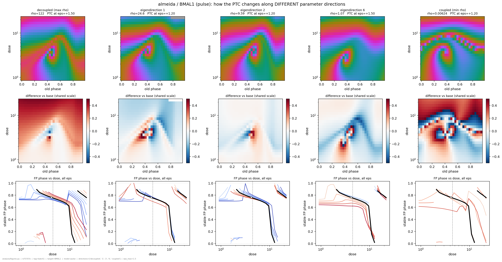

Sweeping five directions spanning the rho spectrum (122 -> 24.6 -> 9.59 -> 1.07 -> 0.006) at
eps up to +/-1.5 gives qualitatively distinct modifications, not merely different magnitudes:

| direction | rho | what it does to the PTC |
|---|---|---|
| decoupled | 122 | a broad, smooth, single-signed offset at high dose, plus a dipole at the singularity |
| eigendirection 1 | 24.6 | the same broad offset with the OPPOSITE sign, and a sharper dipole |
| eigendirection 2 | 9.59 | almost purely a singularity displacement -- nearly zero change elsewhere |
| eigendirection 6 | 1.07 | reshapes the type-0 boundary as a diagonal band |
| coupled | 0.006 | global high-frequency reorganisation; the orbit is lost entirely for eps < -0.3 |

So the eigenbasis is not just an ordering by magnitude -- it separates *kinds* of isochron
change. Direction 2 in particular is close to a pure "move the black hole" knob, which is what
a radialization program would want to steer with.

---

## 4. Method notes that changed an answer

Each of these was found by an independent cross-check, not by inspection, and each had already
produced a plausible-looking wrong number.

1. **A small BVP residual does not mean you have a limit cycle.** `phi_T(y0) - y0 = 0` holds at
   any equilibrium for any `T`, and the phase condition `f(y0)[ref] = 0` holds there too
   because the whole field vanishes. Almeida at `vr x4`: residual ~1e-15, `T = 4.6e5 h`, and
   an "LC sensitivity" of **5e98**.
2. **Negative-orthant runaways do too.** The models clamp the state at 0 inside the RHS, which
   makes the field degenerate for negative states, so a linear runaway closes on itself. At
   `krr x2`: a "cycle" reaching **-2.6e12** that passed both the amplitude and period tests
   and read as a sensitivity of 1e11.
3. **Continue through the relaxation, not into Newton.** Almeida admits a **stable equilibrium
   alongside its limit cycle**, and undamped Newton handed the previous solution jumps into
   it: `vr x1.26`, one step from base, was reported "dead" while an LSODA relaxation shows a
   healthy oscillation of relative amplitude 6.8. Of 8 sampled rejections, **7 genuinely
   oscillated**.
4. **The transient skip must come from the Floquet multiplier.** There is no safe constant.
   Almeida (mu = 0.546) needs 12 periods for a transient to fall to 1e-3; Goodwin (mu = 0.951)
   needs **138**. A fixed 6 leaves 2.6% of Almeida's transient and 74% of Goodwin's — and with
   the two PTC engines skipping different amounts they disagreed by 0.33 cyc while each looked
   perfectly plausible alone.
5. **The Fourier window must span an integer number of TRUE periods.** Windowing on the
   nominal period leaks harmonics into the fundamental and biases the phase, so the dose-0 PTC
   stops being the identity: Goodwin (nominal 24.0 vs true 23.540) was off by 3.6e-3 cyc, 93x
   worse than after the fix.
6. **A phase is only meaningful if there is an oscillation.** `arg` of a near-zero Fourier
   coefficient is noise, and the phase readout returns it without complaint — reporting a
   confident type-0 PTC for a Goodwin clock that had stopped permanently.

### 4.1 Validation status

`python -m engine.validate` — eight checks, all four models PASS:

| check | Almeida | Korencic | Goldbeter | Goodwin |
|---|---|---|---|---|
| jax RHS vs numpy RHS | 0 | 4.5e-16 | 0 | 0 |
| orbit residual | 1.3e-13 | 8.7e-15 | 5.8e-15 | 7.8e-16 |
| period vs adaptive relaxation | 2.8e-09 | 1.3e-11 | 1.5e-10 | 5.1e-11 |
| 8x self-convergence | 2.9e-09 | 1.3e-11 | 4.4e-11 | 6.7e-12 |
| gauge identity | 1.3e-13 | 6.3e-15 | 1.6e-15 | 3.6e-16 |
| gauge covariance of the orbit | 1.4e-14 | 3.9e-15 | 2.6e-15 | 1.5e-14 |
| **two PTC engines agree** | **1.6e-05** | **7.8e-04** | — | **2.6e-04** |

The last row is the one that matters: `engine/ptc.py` (JAX, fixed-step RK4, Fourier phase)
against `engine/reference.py` (scipy LSODA, peak-matching phase) — no shared numerical
machinery, **no offset fitting**, and agreement required on which cells are dead as well as on
the live phases.

---

## 5. Fitting: can a single-gene PTC identify the model?

This is the deviation from the batch-1 plan, taken because the CRY/PER surfaces turned out to
be unusable (3.7) and the more interesting question is whether a model this small can be
RE-FITTED at all -- something that never worked for Mirsky.

**The experiment.** Fit Almeida so that its single-gene PTC matches a perfect radial-isochron
(Poincare) target, with no constraint on limit-cycle shape beyond "it still oscillates". Probe:
**BMAL1**, `instant` mode -- the cleanest surface in the project (`plaq 1 -> 1`, i.e. one raw
winding plaquette and nothing for the dipole filter to do).

### 5.1 Identifiability is SCALE-DEPENDENT (a claim corrected twice)

**First claim.** That Almeida is "not a sloppy model": `J_PTC` rank 13 of 13, condition ~18, so
a single gene's PTC constrains every physically meaningful combination. Offered as the main
reason to expect the fit to work.

**First correction, itself an over-correction.** Those numbers are from the batch-1 `coupling`
jacobians -- pulse mode, wide dose grid, 15 parameters -- while the fit runs instant mode on the
capped window over 16 quotient directions. Measured there: rank **7/16**, condition **2.0e3**.
That prompted "it IS sloppy", which is also not right.

**What is actually true.** The two measurements differ in the FINITE-DIFFERENCE STEP, and the
answer depends on it. `analysis/coupling.py` differences on the factor grid (x1.26 / x0.79, i.e.
h = log 1.26 = 0.231 in log-parameters); the conditioning study used h = 1e-4. Sweeping h on one
fixed configuration (pulse, 12 phases x 8 doses, cap 6 S_crit):

| h | parameter change | rank @1e-2 | condition |
|---|---|---|---|
| 1e-4 | 1.000x | 8/16 | 2.00e3 |
| 1e-3 | 1.001x | 8/16 | 2.00e3 |
| 1e-2 | 1.010x | 8/16 | 1.17e3 |
| 0.05 | 1.051x | 10/16 | 4.33e2 |
| **0.231** | **1.26x** | **16/16** | **6.46e1** |

h = 1e-4 and 1e-3 agree exactly, so the small-step values are the converged local derivative, not
a differencing artifact.

**So both numbers are right and they answer different questions.**

- **At the +-26% scale the model IS identifiable from one gene's PTC**: all 16 directions
  produce a distinguishable change, condition ~65. A 26%-different Almeida is tellable from
  nominal.
- **Locally it is not**: rank 8 of 16, condition 2000. About eight directions are flat at the
  bottom.

That is a broad, well-shaped basin with a flat floor -- and it predicts exactly what T1 did:
the cost fell 10x (the basin is real and findable) while the parameters drifted further away
(the floor carries no information).

**The consequence for fitting.** A PTC fit can place Almeida within roughly tens of percent and
cannot pin it further. Any recovered parameter set must be reported as a basin, not a point, and
"the cost went down" is not evidence that the parameters are right -- T1 is the counterexample.

**And what does NOT explain it.** Four factors were varied one at a time and none moved the local
rank: phase/dose resolution (4x more cells: 7/16 -> 7/16), dose ceiling (6 -> 18 x S_crit:
7/16 -> 7/16), perturbation mode (instant 7/16 vs pulse 8/16), and step size within the
small-step regime. The flat directions are a property of the single-gene PTC map itself.

**Methodological note, now four errors deep.** Mirsky's dose grid, the amplitude floor, the Hopf
barrier scale, and this conditioning number were all inherited across a change of setup, and all
four were wrong in the new one while looking authoritative. Each was caught only by testing
against a case with a known answer. Nothing scale-bearing should be carried into Korencic or
Goldbeter without re-measuring it.

### 5.2 The failure this is designed against

`input_screen/radialize.py` already ran this experiment on Mirsky and **converged to a
degenerate optimum**: cost 0.89 -> 0.159 in 11 L-BFGS iterations, achieved by annihilating the
singularity and collapsing the limit-cycle amplitude. The optimizer walked the clock to a Hopf
bifurcation; the twist "improved" because the oscillation was dying. Parameters moved less than
4%.

Both terms of that cost (twist span, singularity position) are *minimized* by a dying
oscillator. The cost here inverts that: it is a **pointwise match over the whole surface**, and
an unusable cell scores the **maximum** rather than being dropped. A dead oscillator therefore
becomes the worst point in the space instead of the best. Asserted by
`python -m fit.cost --selftest`: base **0.292**, Hopf-collapsed **2.748**.

### 5.3 Four things the plan got wrong, each caught by a measurement

Recorded because each was a plausible assumption that a check refuted.

1. **"Hazard 1 is about RK4, so the adaptive backend fixes the gradient."** Half right. The
   blow-up (|grad| = 2.0e75) *survived* the switch to Tsit5. Three further hypotheses were
   refuted too -- not the penalty terms (the Hopf barrier's own gradient is 1.4e-03), not
   amplitude collapse or runaway (relative amplitude stays in [0.999, 1.000475] with every cell
   alive), and not reverse-mode instability over the transient skip (shortening `skip_p` 8 -> 2
   -> 1 leaves it at 1.2e73, flat). What remains is genuine non-smoothness in PARAMETERS: a
   +454 kick into a species whose cycle spans ~4 lands near the basin boundary of the
   equilibrium that coexists with the cycle. The trajectory still returns -- hence a healthy
   amplitude and a bounded cost -- but *where* in phase it returns depends on which side it
   passed. Fix: `fit/doses.py` caps the fit window at `6 * S_crit`; |grad| 2.0e75 -> **1.13**,
   and autodiff then matches finite differences to 1e-4.
2. **The characterization dose grid is not the fit dose grid.** They differ by design and now
   have separate code paths.
3. **Two constants inherited from input_screen were charging a healthy ground truth.** The
   amplitude floor (0.5 of nominal) charged 0.153 to a displaced-but-healthy truth whose PTC
   residual was 1e-12; the Hopf barrier (margin 0.015, k 200 -- Mirsky's scale) charged 0.766
   to a truth at `Re(lambda) = 0.0143`, which is POSITIVE and therefore genuinely
   self-sustained. Either would have moved the global minimum off the truth and made the
   control measure the penalty rather than the landscape. Both are now derived from the model
   (`amp_frac = 0.05`, `margin = 0.02 * re_nominal`, `k = 30 / re_nominal`).
4. **RK4 at dt=0.02 is the wrong answer on this dose range, not merely the slower one.** It
   disagrees with the adaptive backend by 8.2e-03 cyc and *converges to it* on refinement
   (5.97e-04 at dt=0.01, 7.65e-05 at dt=0.005) -- which is independently what `analysis/scrit`
   concluded when it chose dt=0.00125 for BMAL1/instant.

The general lesson, now three times over: **constants and grids inherited from the Mirsky work
are not transferable to a smaller model**, and they fail silently. Expect the same moving to
Korencic and Goldbeter.

### 5.4 THE RESULT: from-distance locality is not a large-model artifact

This is what the model switch was made to find out, and it is a negative answer.

`input_screen` PROJECT_SUMMARY names "from-distance locality" as the framework's central
weakness: on Mirsky, L-BFGS recovered **132/132** parameters when started AT the truth and
stalled near **26/132** when started away from it. The natural hypothesis -- the one that
justified moving to smaller models -- was that this is a symptom of 132 parameters with ~100
flat directions, and would go away at 16.

**It does not.** The self-recovery control on Almeida, in-class target, truth reachable by
construction:

| start | optimizer | cost (floor 3.9e-4) | RMS log-distance to truth | params within 10% |
|---|---|---|---|---|
| **at the truth** | L-BFGS | 0.000392 -> **0.000392** | 0.283 -> **0.0000** | **18/18** |
| from nominal (26% away) | L-BFGS | 0.592 -> 0.0607 | 0.283 -> 0.685 | **0/18** |
| from nominal (26% away) | CMA-ES | 0.592 -> **0.0286** | 0.283 -> 0.597 | **2/18** |

The from-truth run settles the objective: started at the answer, L-BFGS stays there in two
iterations and returns all 18 parameters exactly. **So the truth is a genuine isolated minimum
and the cost is sound** -- the failure from nominal is about REACHING it, not about what is
being minimized. That is the same signature as Mirsky, reproduced at 16 dimensions on an
unrelated model with a well-conditioned coarse structure.

Two optimizers, one gradient-based and one gradient-free, land 0.6 away in parameters from a
start 0.28 away. Neither reaches the floor: CMA's best is 0.0286, still **73x** above the
truth's cost, so this is not a wide flat plateau being wandered -- the search never gets down
to the floor at all.

**Why the landscape is so hostile.** Gradient norms during these runs reached **1.98e25** from
nominal and **1.58e42** starting at the truth (39 of 49 evaluations clipped). The cause is
identified: Almeida has a stable equilibrium coexisting with its cycle, and a perturbed
trajectory that passes near that basin boundary returns to the cycle at a phase that depends on
which side it passed. The forward value stays bounded and healthy -- relative amplitude in
[0.999, 1.0005], every cell alive -- so the cost looks perfectly well behaved while its
derivative does not exist in any useful sense. `fit/doses.py` keeps the worst doses out of the
window and `fit/search.GRAD_MAX` rescales what is left, but the spikes are intrinsic to the map.

**What this means for the programme.** The model switch was the right experiment and it
answered its question: the obstacle to fitting PTCs is not model size and not
gauge-degeneracy. It is a property of PTC landscapes -- a well-defined minimum surrounded by a
region in which no local method can navigate. Going to still smaller models will not help.
The productive directions are (a) better targets: more probes, if genes are non-redundant
(5.5), and (b) accepting basin-level answers, since 5.1 shows the model IS identifiable to
within tens of percent even where it cannot be pinned.

**T3 (the radial fit) is therefore NOT worth running yet**, and has not been run. Fitting an
out-of-class target through a map that cannot recover an in-class one would produce a number
with no interpretation.

### 5.4b THE ANSWER TO OBJECTIVE (b): a PTC is worth ~3-4 trajectories, per gene

Non-uniqueness was always the premise, so the quantity of interest is not "can we recover the
parameters" -- it is the DIMENSION of the family of parameter sets consistent with the data:

    dim(solution set) = n_free - rank(J)

measured LOCALLY. (`analysis/coupling.py` compares LC and PTC only at the +-26% factor step,
where both saturate at 16/16 and the comparison cannot discriminate. See 5.1.)

`analysis/identifiability.py`, Almeida, instant mode, 16 gauge-quotient directions, h = 1e-3:

| observable | rank @1e-2 | dim(solution set) | condition |
|---|---|---|---|
| **matched, one gene (BMAL1)** | | | |
| LC -- BMAL1 trajectory alone | **3/16** | 13 | 6.81e5 |
| PTC -- BMAL1 alone | **7/16** | 9 | 2.02e3 |
| LC + PTC, same gene | 8/16 | 8 | 1.75e3 |
| **unmatched, for reference** | | | |
| LC -- all 8 species x 64 phases | 13/16 | 3 | 1.65e3 |
| LC (8 species) + PTC (1 gene) | 13/16 | 3 | 4.64e2 |

**Matched per observable, the PTC wins decisively.** One gene's PTC determines 7 directions
against 3 for that same gene's time course, and adds **5** directions the trajectory cannot see,
while the trajectory adds only **1** beyond the PTC. Conditioning differs by two orders of
magnitude. Scale it: 8 species of trajectory buy 13 directions and one species buys 3, so a
single-gene PTC (7) is worth roughly three to four full trajectories.

**That is objective (b) answered in the affirmative** -- PTC data constrains this model in ways
LC data cannot, and by a large factor per unit of experiment.

**The unmatched rows are a trap and are kept only as a warning.** Taken alone they say "PTC adds
0 directions beyond LC", which is true and nearly vacuous: eight species of trajectory against
one perturbation experiment measures data VOLUME, not information content. Any design claim has
to come from the matched rows.

**Where the complementarity lives.** Principal angles between the top-7 determined subspaces of
the 8-species LC and the PTC are 0.2, 0.9, 9.1, 19.2, 36.7, 57.1, 77.6 degrees: the strongest
directions the two share almost exactly, and they diverge only in the weaker ones. Consistently,
LC(8 species) + PTC reaches **16/16 at the 1e-3 threshold** where neither alone does (15 and 14),
and conditioning improves 3.5x. So even against a rich trajectory dataset the PTC contributes --
just weakly, and in the directions that were already marginal.

**Relation to the batch-1 rho = 122 "decoupled direction" (3.7).** No contradiction: rho measures
RELATIVE SENSITIVITY (the PTC responds more strongly along that direction), not rank
complementarity (the PTC sees something the LC cannot). Both statements hold at once, and they
are different claims about the same geometry.

### 5.4c WHY the optimizers stop: the spiral / cross-correlation problem

The optimizers are not doing badly. CMA-ES reaches c_ptc = 0.026, a typical phase error of
**1.24 h** on a 24 h clock, from a start at 6.65 h. What stops it has a specific geometric
cause, and it is not a defect in the search.

**The pointwise cost is not monotone in singularity displacement.** Two independent
demonstrations:

| | c_ptc | S_crit | phi* |
|---|---|---|---|
| CMA's minimum | 0.0260 | 6.979 | 0.521 |
| `barrier-c` (t = 0.70 toward the truth) | **0.0616** | **5.458** | **0.604** |
| truth | 0.0000 | 5.458 | 0.604 |

`barrier-c` has the truth's **exact** singularity location and costs 2.4x more than CMA's
solution, which does not. And along the segment CMA -> truth, the soft singularity location
moves steadily CLOSER to the target (distance 0.0320 -> 0.0132 over t = 0 .. 0.25) while c_ptc
rises monotonically (0.02596 -> 0.03174). Moving the defect onto its target makes the fit worse.

**The mechanism.** Around a singularity the PTC is a spiral. Comparing two such surfaces is a
cross-correlation of two spirals: alignment oscillates with relative displacement instead of
improving monotonically, and every half-turn of relative rotation is a local minimum. A denser
spiral -- more twisted isochrons, or a finer grid -- produces more of them, so the landscape
gets MORE rugged as resolution improves. The same geometry applies to the strongly twisted
type-0 region at high dose, which is where the L-BFGS solution is stuck: its residual is a band
at dose 50-100, not a spot at the singularity.

**A singularity-location feature term does NOT fix this**, which was the natural guess. From
t = 0.50 onward the detected `(S_crit, phi*)` is pinned at the truth's values for the entire
rest of the path while the cost swings 0.046 -> 0.062 -> 0.000. Over exactly the stretch where
guidance is needed, such a term is constant and contributes no gradient. The feature saturates
long before the surfaces agree.

**What does work is alignment, and the radial target already has it.** `fit/target.profile`
optimizes the relative registration `(k, psi)` between model and target on every evaluation --
dose scale and kick direction -- at zero ODE cost, because the target is closed-form. That is
the cross-correlation fix proper: find the shift that maximizes alignment rather than comparing
at fixed registration. The self-recovery control does NOT profile alignment (its target is in
the model's own units), which is part of why its landscape is harsher than the radial fit's.

`fit/target.soft_singularity` provides a smooth, unquantized singularity location for use as a
staged term where it does have signal. Its temperature adapts to the amplitude range: a fixed
one fails outright here, because |z| never falls below 0.79 on this grid -- the singularity sits
BETWEEN cells and the dip is never resolved -- so fixed weights underflow and the centroid
degenerates to the grid's own log-mean.

**Consequence for the programme.** CMA-ES on the radial target is the right tool and is worth
running as it stands: the alignment profiling is already in place, and the optimizer demonstrably
moves a long way toward the objective before the spiral geometry stops it.

### 5.5 Genes are NOT redundant -- the opposite of the Mirsky prescription

Since dose variation was ruled out (5.1: widening the window 3x moves nothing), the remaining
lever is the probe. Rank of stacked per-gene surface jacobians, each block scale-normalized so
no probe dominates, **quality-gated surfaces only**:

| probes | rank @1e-2 | rank @1e-3 | condition |
|---|---|---|---|
| BMAL1 alone | 7/16 | 14/16 | 2.02e3 |
| any single (BMAL1, PER, PER_CRY, DBP) | 7-8/16 | 13-15/16 | 2.0e3 - 9.8e3 |
| any two | 9-11/16 | 15-16/16 | 8.2e2 - 1.9e3 |
| any three | 11-13/16 | 16/16 | 5.2e2 - 8.3e2 |
| **all four** | **13/16** | **16/16** | **5.08e2** |

Four probes nearly double the determined rank and improve conditioning 4x. Three directions
remain poorly determined even then.

**This inverts the Mirsky design rule.** There the finding was that single-gene PTCs are highly
redundant, and the advice was *vary dose, not gene*. In Almeida dose does nothing and gene is
the informative axis. **Optimal PTC experimental design is model-dependent and does not
transfer** -- which is a result the complexity ladder was built to be able to state.

Two details worth keeping:

- **BMAL1 is the WEAKEST probe** (7/16) despite having the cleanest surface in the project
  (`plaq 1 -> 1`). `PER+PER_CRY+DBP` reaches 13/16 without it. A clean surface is not an
  informative one, and the two were being conflated when BMAL1 was chosen as the fit probe.
- **The quality gate overturned the headline number.** The first pass of this table included
  E4BP4 and reported the best single probe at 10/16 (condition 609) and four probes at 14/16
  (condition 290). E4BP4 then FAILED the gate (winding set {-1, 0, +1}), as did REV. A jacobian
  of a phase-scrambled surface is a jacobian of noise, and **noise inflates numerical rank** --
  so the broken probe produced the most attractive number, exactly as CRY's broken surface had
  produced the largest S_crit/twist/rho in 3.7. Same trap, opposite sign, caught only because
  the gate now runs before anything is quoted.

### 5.5b Status

`fit/` is built and self-tested: `target.py`, `cost.py`, `search.py` (L-BFGS, multistart,
CMA-ES, BOBYQA), `doses.py`, `recover.py` (T1, with `--start truth` and `--optimizer`),
`radial.py`, `viability.py`, `campaign.py`, `aggregate.py`, `figures.py`. T0 and T0.5 pass; T1
fails from a distance and passes from the truth. T3 (radial) has now RUN on the cluster, twice
-- see 5.10, which is also where the reasons not to trust its headline numbers are.

### 5.6 Optimizer head-to-head: a model-based trust region wins

Matched budget, 1500 evaluations, T1 self-recovery, BMAL1/instant, cost at truth 0.000392 and
at nominal 0.592153:

| optimizer | final cost | evals | wall | note |
|---|---|---|---|---|
| **Py-BOBYQA** | **0.010388** | 1500 | 684 s | stopped on MAXFUN -- still improving |
| cma-anneal | 0.039718 | 1489 | 667 s | monotone over 4 restarts, sigma 0.5 -> 0.046 |
| cma-ipop | 0.067431 | ~1500 | ~670 s | restarts 1-2 got WORSE (2.12, 1.24) |
| Levenberg-Marquardt | 0.435844 | 37 | 83 s | |

BOBYQA wins by 3.8x over the best CMA arm, and beats the previous overall incumbent
(cma-ipop 0.0198 at a larger budget) at less than half its budget. This is what §5.4c's spiral
picture predicts: a model-based trust region fits a quadratic through interpolation points
spread over a region wide enough to AVERAGE OVER the fine-scale ruggedness that stalls a
gradient and that CMA can only sample through.

Two further results in the same table. `cma-anneal` beats `cma-ipop`, and the mechanism is
visible in the timings: IPOP's larger populations ran 88-193 s/gen at popsize 24/48 against
3-7 s/gen at popsize 12, because the extra samples land on pathological parameter sets whose
orbit solves are slow. And LM ran at all only after the Hopf barrier's eigenvalue helper was
converted from `jax.custom_vjp` (reverse mode ONLY) to `jax.custom_jvp` (both) -- `jacfwd`
through a `custom_vjp` raises, which had been killing every LM leg inside the Hopf barrier,
nowhere near the flow anyone would have suspected.

DEAD ENDS REMOVED FROM THE CODE, RECORDED HERE: `nelder_mead` (T1 0.4449) and
`smoothed_trust_region` (benchmark 0.348) were both measured and both lost. The second was a
hand-rolled approximation of exactly what BOBYQA does properly. Keeping three implementations
of one idea, two known worse, is how a directory becomes a museum.

### 5.7 RETRACTION: the RAD01 "degenerate optimum" was a bad OBSERVABLE, not a dead clock

RAD01 (CMA radialization) reported `c_ptc = 0.0110` -- a nearly perfect radial match -- from a
parameter set whose orbit BVP had residual 3.58. It was first written up here as the Mirsky
degeneracy reproduced: a dead oscillator scoring well. **That reading was wrong**, and the
correction matters because it changes what the pipeline has to defend against.

The dynamics at that parameter set are HEALTHY. End-to-end perturbation simulations across
(phase x dose) oscillate in every species, stay strictly positive and stay bounded to 400 h
(`out/almeida/fit_radial/RAD01/endtoend_perturbations.png`). What fails is the phase
MEASUREMENT: BMAL1 -- which was simultaneously the Poincare section, the Fourier readout and
the perturbation target -- transiently collapses to 1.2e-27 there while REV sits at 1.2e3.
Thirty decades in one state vector makes the system stiff enough to stall Newton and to exhaust
the integrator. See REPO_MAP hazard 14 for the full measurement.

Consequences now in the code:

* `reference_variable` (Poincare section) and `readout_variable` (phase carrier) are SEPARATE,
  because they have different requirements -- unimodality versus a healthy baseline.
  Almeida: section `PER`, readout `REV` (the experimental observable).
* Verified harmless: BMAL1 / REV / PER readouts agree to max **5.6e-4 cyc** at base, so this is
  a change of phase ORIGIN, not of the PTC. Prior BMAL1-readout results stand.
* The orbit gate added to `fit/cost._surface` (residual < 1e-4, period in [0.25T, 4T],
  non-negative states, finite) DOES reject the RAD01 optimum: re-scored under the current cost
  it returns `c_ptc = 1.000000, alive_frac 0.000` instead of 0.0110. The escape route is shut.

### 5.8 What parallelism is actually available (measured, not assumed)

One cost evaluation on the 20 x 14 grid = one serial orbit BVP solve (114 ms) plus 280
independent perturbation integrations (1.505 s total). Serial fraction 7.5%, so Amdahl caps a
perfect implementation near 13x. CPU threading realises NONE of it:

    threads=1  1.298 s     threads=2  1.482 s     threads=4  1.552 s     threads=8  1.539 s

More threads are SLOWER. Each cell is an adaptive Tsit5 integration, sequential by nature, and
XLA's CPU backend does not parallelise the vmap across cells. So:

* **the cluster buys throughput, not latency** -- a single fit takes as long there as locally,
  and the array width is what makes N of them cost the wall time of one. `slurm/fit_cpu.sh`
  accordingly dropped to `--cpus-per-task=1` and doubled to `--array=0-15`;
* **a GPU is only worth it after `search.cma` evaluates its population in one batched call**
  (12 x 280 = 3360 cells per launch instead of 280). Even then, f64 is required and runs at
  1/32 rate on consumer cards, and vmapped adaptive steppers waste work marching in lockstep to
  the slowest cell. Estimated 3-10x for a single evaluation, 10-30x for a batched generation --
  to be MEASURED before it is believed.

### 5.9 THE TWIST METRIC SATURATED, AND THE DOSE AXIS WAS ALIASED

Two independent measurement faults, found together, and between them they qualify every twist
number this project has reported.

#### 5.9a `total_twist` is capped at 0.5, and Almeida's base sits at 0.4999

`total_twist` is `circ_span` -- the largest pairwise circular distance among the twist curve's
values -- which cannot exceed half a cycle by construction. Almeida's BMAL1 base measures
0.4999: PINNED TO THE CEILING. The metric returns 0.5 whether the isochrons wind half a turn
across the dose axis or fifty.

Consequences:
  * every "twist 0.49 -> 0.18" style comparison was measured against a SATURATED reference. The
    reductions are real (the fitted values sit well below the cap) but the starting twist is
    unknown, so the FACTOR of improvement is not a measurement;
  * per-gene twists cannot be ranked against each other anywhere near 0.5;
  * a faster spiral is INVISIBLE, which is why the first convergence test looked reassuringly
    flat -- a saturated quantity cannot change.

`accumulated_twist` (analysis/winding) sums the unwrapped shortest-arc steps along dose and is
unbounded, so a triple winding reads ~3. On the same BMAL1 base it reads **4.77 cycles**, not
0.5 -- the saturated metric was reporting a tenth of the real winding.

#### 5.9b The dose axis was under-sampled, and aliasing does not look like noise

Holding the dose RANGE fixed and refining only the sampling, on BMAL1 base:

    n_dose      12       24       48       96
    accum    2.8996   3.9716   4.7712   4.7717
    change       --   +37.0%   +20.1%    +0.0%     <- converged at 48
    scramble 0.0130   0.0117   0.0111   0.0114     <- PASSES the gate at every resolution

The measured twist climbs 65% before it converges, and the quality gate never notices: an
under-sampled spiral is not incoherent, it is a SMOOTH, PLAUSIBLE, WRONG twist. Scramble
detects incoherence between neighbours, not a coherent alias. Refining the PHASE axis instead
changes nothing (4.743 -> 4.782 from 16 to 64), so the aliasing is entirely on DOSE -- which
matches the geometry, the spiral's pitch being in dose.

    THE CAMPAIGN USED 14 DOSE SAMPLES. THE SURVEY USED 24. BMAL1 NEEDS 48.

#### 5.9c Aliasing reverses direction before it destroys magnitude

A synthetic spiral of known winding (+12 cycles CCW), sampled at various rates:

    samples      8       12       16       24       25       48
    adv/samp 1.714    1.091    0.800    0.522    0.500    0.255
    signed  -2.000   +1.000   -3.000  -11.000  +12.000  +12.000

At 24 samples the MAGNITUDE is 92% correct while the DIRECTION is inverted -- a clockwise
reading of a counter-clockwise spiral, the wagon-wheel effect. At 12 it reads +1.0: right
direction, one twelfth of the truth, i.e. "looks almost radial". Both failure modes matter here
because FLATNESS IS THE SUCCESS CRITERION -- an aliased fast spiral and a genuine radial PTC
are the same picture.

`signed_twist` is therefore reported separately from `accumulated_twist`: a SIGN FLIP between
two sampling rates is direct evidence of under-sampling, and it appears at coarser sampling
than the magnitude error does.

#### 5.9d The required resolution is per-gene and varies 16x -- REV's re-entrancy is REAL

    gene    accumulated twist    dose samples needed
    BMAL1        4.77 cycles     >= 48  (reads 2.90 at 12: a 40% under-read)
    REV          0.30 cycles     12 is ample

So there is no globally safe resolution. It has to be set per gene from its own convergence
check -- and re-checked on FITTED surfaces, since the winding rate moves with the parameters.

This also settles a hypothesis worth recording as refuted. REV's base shows THREE singularities
at doses 129 / 754 / 2660, all near phase 0.5, with charges +1 / -1 / +1, and the natural guess
was a thin spiral being badly sampled. It is not: across an 8x dose refinement the count, the
charges, the accumulated twist (0.296) and the signed twist (-0.192) are IDENTICAL to three
decimals. REV genuinely has re-entrant resetting -- winding 1 -> 0 -> 1 -> 0 as dose rises, the
+/- charges being the defects at each re-entry, with the winding SET staying [0, 1] throughout.
Compare the `PER1 re-entrant` outlier noted in the Mirsky work.

Note also what this does NOT license: the negative winding numbers seen elsewhere ([-1, 0, 1]
under pulse, [-2, -1, 0, 1] for PER at high dose) were speculated to be the same artefact. For
REV that speculation is now disproved, and it has not been tested for the others.

#### 5.9e Which saved results were actually affected

Every case below holds the dose RANGE fixed and refines only the sampling, so any change is
sampling alone.

    case                        n_dose:  12      24      48      96     verdict
    BMAL1 base   pulse   |accum|      1.402   3.281   4.607   4.940   ALIASED, not converged
                          signed     +0.606  -1.948  -3.880  -4.940   SIGN FLIP at 24
                        scramble     0.0000  0.0000  0.0000  0.0000   gate blind throughout
    BMAL1 RAD03 fitted   |accum|      1.078   1.199   1.509   1.434   NEVER CONVERGES
                          signed     -0.199  -1.199  -0.199  -1.199   oscillates
                          n_sing           3       3       1       3
    PER   base   pulse   |accum|      0.552   0.593   0.612   0.629   mild drift, +14%
    REV   fitted         |accum|      0.258   0.259   0.260   0.260   converged at 12
    PER   fitted         |accum|      0.082   0.082   0.082   0.082   converged
    CRY   base           |accum|      0.443   0.449   0.451   0.453   converged (quality FAILS)

THE ALIASING IS GENE-SPECIFIC, AND IT IS BMAL1. Its isochrons wind ~4.8 cycles across the dose
range (4.94 and still climbing under pulse); everything else winds slowly enough -- REV 0.26,
PER 0.08-0.63, CRY 0.45 -- that 12 samples already converge. There is no global safe
resolution, and the gene we have fitted most is the one that needed the most.

THE QUALITY GATE CANNOT SEE THIS. BMAL1 base pulse scores scramble 0.0000 at EVERY resolution
while its measured twist is wrong by 3.5x and its direction is inverted at 12-24 samples. The
gate tests coherence between neighbouring cells, and a coherent alias is still coherent. It is
therefore not a sufficient check that a surface is resolved; the convergence test is.

TWO RESULTS CHANGE:

  * RAD03's FITTED surface is not resolution-stable -- twist 1.08 / 1.20 / 1.51 / 1.43 and a
    signed twist alternating between -0.199 and -1.199 as sampling doubles, with the
    singularity count flipping 3/3/1/3. It was the most heavily analysed fit in this project
    and its geometry is not established.
  * REV's radialization is REAL but far smaller than reported. Its fitted twist of 0.260 is
    genuine (converged at 12 samples, unaliased), but measured against its own base on the SAME
    range with the unsaturated metric the improvement is 0.296 -> 0.260, about 12%. The
    campaign's headline "0.4983 -> 0.0394, a 92% reduction" was saturation against a misplaced
    dose window, not radialization.

WHAT SURVIVES: PER's [-2, -1, 0, 1] winding is identical at 8x refinement, so it is not an
aliasing artefact either. The likelier reading is the one established independently in 5.7 --
that optimum's orbit REPELS (growth 1.44), and asymptotic phase does not exist on a repelling
orbit, so the winding computation has nothing well-defined to measure. That is a stability
failure, and the guard for it is the stability term, not more dose samples.


### 5.10 THE FIRST CLUSTER CAMPAIGNS -- and the residual fell almost entirely in the part of the target that carries no information

Two campaigns, 20 CMA searches at 8000 evaluations each, commit `c9e7909`. Summed per-search
wall time 17.1 h (0.45-1.70 h each) at 32 workers per task, so ~550 CPU-hours; elapsed was a
quarter of that, the tasks being an array. All 20 completed.

- **`campaigns/bmal1_seeds.json`** -- BMAL1/instant, 16 independent seeds, each started from a
  rejection-sampled *healthy circadian clock* (`start='viable'`), run as 4 array tasks of 4.
  The multimodality question.
- **`campaigns/genes.json`** -- one radialization per gene (BMAL1, PER, CRY, REV) from BASE,
  one seed each. Which probes can be radialized at all.

**READ 5.9e FIRST FOR THE TWIST COLUMNS.** Every accumulated / signed twist below is read off
the campaign's own saved twist curve, which lives on the **fit** dose window at **14 samples**
-- and 5.9b-e establishes that 14 is not enough for BMAL1 and that an under-sampled spiral
looks smooth, plausible and wrong. Refined on the characterization range, REV's fitted twist
converges to 0.260 against a base of 0.296, a 12% reduction, where the campaign's 14-point
reading suggests a far larger one. So the twist numbers here are **ordinal at best and not
magnitudes**, and none of 5.10's conclusions rest on them: the load-bearing measurements are
the residual split by dose (5.10c), the quotient distances (5.10a) and the surfaces
themselves.

**Aggregation was missing and is now `fit/aggregate.py`.** `run_seeds` compares only the seeds
that share one array task, which is all one task can see, so a 16-seed campaign split four ways
produced four 4-seed comparisons and no 16-seed one -- and 16 seeds in four separate clusters
look exactly like one cluster of four when every distance measured is within a task. The
aggregator joins the per-seed `radial_*.npz` (not the per-task summaries, which carry only
`v` and `cost`), refuses to join runs that disagree on the experiment or the dose grid or the
pinned target, and writes one fat npz with the raw surfaces. Figures: `fit/figures.py
--which seeds | genes`.

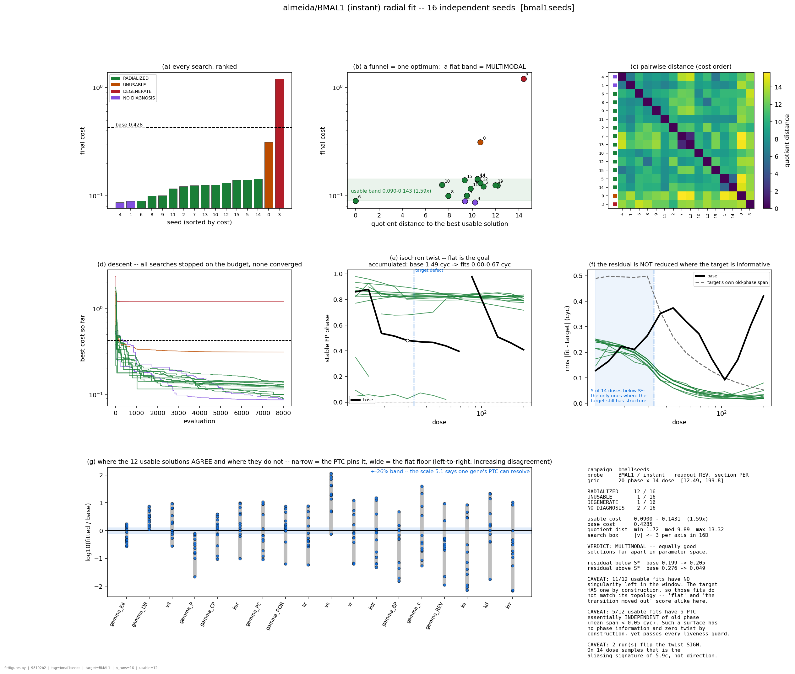
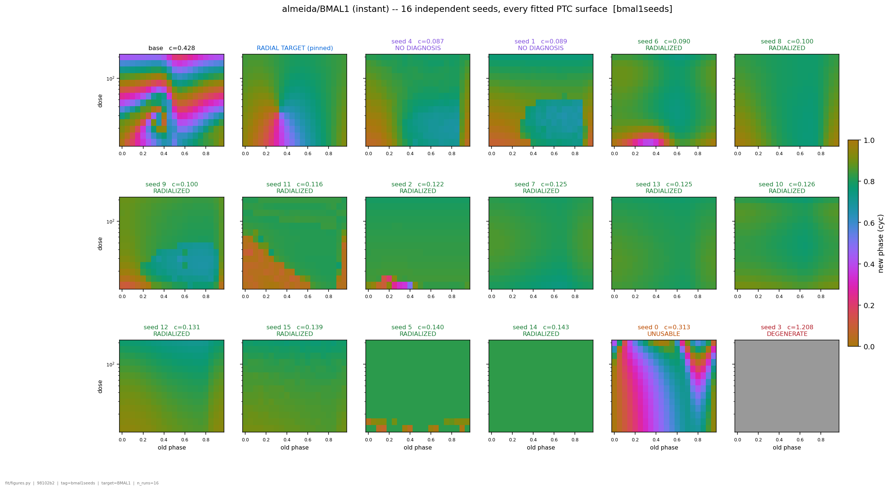
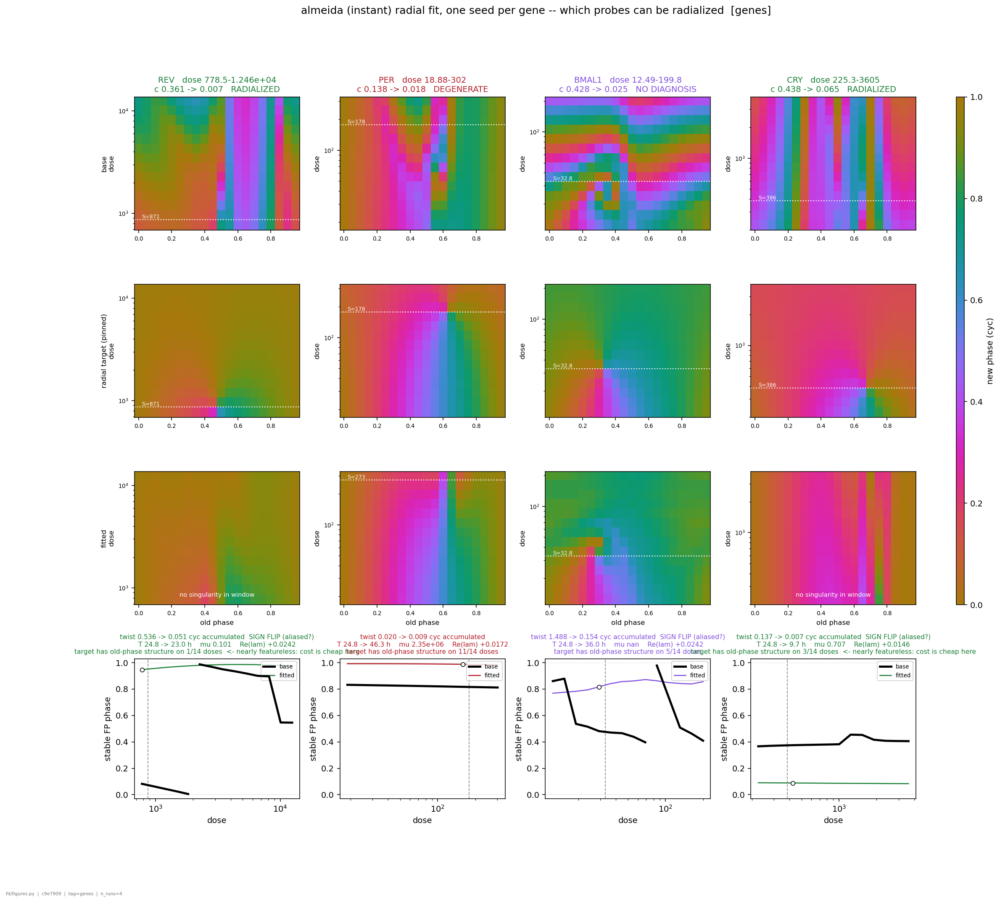

#### 5.10a The landscape is MULTIMODAL, and not marginally

| | |
|---|---|
| usable runs (RADIALIZED / PARTIAL) | **12 of 16** |
| their cost | 0.0900 - 0.1431 -- a **1.59x** spread |
| their pairwise gauge-quotient distance | min 1.72, **median 9.89**, max 13.32 |
| the search box | `bound = 3` per axis in 16 dimensions (max possible separation 24) |
| per-parameter disagreement | 0.81 - 3.19 **decades**, median 2.15 |
| parameters agreed to within +-26% | **0 of 18** |

Twelve searches that all pass the liveness and quality gates and land within a factor 1.6 in
cost sit a median of 9.89 apart in a box of radius 3 -- 41% of the largest separation the box
allows. §5.1 measured that a **+-26%** Almeida is distinguishable from nominal by one gene's
PTC; these solutions differ by one to two orders of magnitude in individual parameters. That is
not a flat floor being wandered, it is distinct optima.

**The four non-usable runs are THREE different failures, and they must not be pooled.** One
genuinely dead clock (seed 3: `Re(lambda) = -2.5e-07`, i.e. the stable side of the Hopf
bifurcation, `alive_frac 0.000`, cost pinned at the maximum 1.208 -- the cost's degeneracy
guard working exactly as designed). One surface failing the PTC quality gate (seed 0). And two
whose *diagnosis* failed, which is a different claim entirely -- see 5.10e.

#### 5.10b A random viable start is WORSE than base, by 3.7x

Best viable-start seed **0.0900**; the from-base single-seed BMAL1 run **0.0245**. Sixteen
independent searches from dispersed healthy clocks, at 8000 evaluations each, none of them
reached what one search from nominal reached. The viable starts sit at `|v| = 4.2 - 7.7` and
the fits end at `|v| = 6.8 - 10.0`, so they did not converge back toward the base region at
all. This is §5.4's from-distance locality again, now measured with 16 starts instead of one:
dispersing the start does not buy the search anything.

#### 5.10c WHERE THE RESIDUAL FELL IS NOT WHERE IT MATTERS

This is the finding that qualifies every cost number in both campaigns.

A Poincare (radial) target is only *informative* below its own singularity. At dose >> S* it
resets to nearly the same phase whatever the old phase was, so its old-phase structure decays
away. Measured on the BMAL1 grid -- the CIRCULAR span of each dose row, which ceilings at 0.5
because 0.5 already means "sweeps the whole phase circle":

    dose/S*  0.38  0.47  0.58  0.72  0.89 | 1.11  1.37  1.69  2.10  2.60  3.21  3.98  4.92  6.09
    span     0.49  0.50  0.50  0.49  0.50 | 0.36  0.26  0.20  0.16  0.13  0.10  0.08  0.07  0.05

The fit window runs 0.38x to 6.09x S*, log-spaced, so **9 of its 14 dose rows are in the flat
asymptote and only 5 carry isochron geometry.**

(That span has to be circular. Written first with an arithmetic mean subtracted, it read 4
informative rows for REV against a true 1, because REV's target sits at `psi = 0.975` and its
rows straddle the 0/1 wrap. `analysis.winding.circ_span` is the house function for this and is
what `fit/figures._span_vs_dose` now calls.)

Split the residual on that line, over the 12 usable seeds:

| | base | fitted |
|---|---|---|
| rms residual **below** S* (5 doses -- informative) | 0.1986 | **0.1808 - 0.2206** |
| rms residual **above** S* (9 doses -- nearly featureless) | 0.2755 | **0.0352 - 0.0573** |

**Below the singularity the fits are no better than the base, and several are worse.** The
entire drop from 0.428 to ~0.10 was bought in the region where almost any strongly resetting
surface scores well. Pooled into one `c_ptc` this is invisible; it is `fig_seeds` panel (f).

The mechanism is visible in the surfaces (`seeds_BMAL1_instant_surfaces.png`): **11 of the 12
usable fits have no phase singularity left anywhere in the dose window** (`n_sing = 0`) --
they pushed the type-1 -> type-0 transition below the window's floor, making every sampled
dose supercritical. The target HAS a defect at S = 32.79 by construction, so those fits do not
match its topology at all. "The isochrons went flat" and "the transition moved out of the
window" score alike under a pointwise cost.

#### 5.10d A degeneracy that passes every existing guard: the phaseless PTC

**5 of the 12 usable fits have a PTC that does not depend on old phase** (seeds 5, 7, 13, 14,
15: mean old-phase span < 0.05 cyc, against 0.5 for a full sweep; seed 14's is *constant to
four decimals*). Such a surface carries no phase information at
all -- the perturbation resets the clock to the same place whenever it is applied -- and it has
zero twist by construction, so `less_twist` is satisfied trivially and the verdict reads
RADIALIZED.

It passes everything the cost defends: the oscillator is alive (`Re(lambda) > 0`), the fixed
point converged, the Floquet multiplier is healthy (0.624, 0.666, 0.753, 0.758, 0.784), the
amplitude is within range. §5.2 built the cost against a *dead* oscillator and §5.7 against a *bad observable*;
this is a third route, and it is the one a radial target invites, because a flat PTC IS the
target's own high-dose asymptote. **A twist of zero is only evidence of radial isochrons if the
surface still resolves old phase.** Nothing currently checks that.

#### 5.10e The gene ranking is an artefact of where each target's defect landed

| gene | c_ptc | doses below S* | verdict | reading |
|---|---|---|---|---|
| REV | 0.3612 -> **0.0071** | **1 of 14** | RADIALIZED | target nearly featureless -- close to vacuous |
| PER | 0.1379 -> **0.0184** | **11 of 14** | DEGENERATE | the demanding target, but the orbit REPELS (growth 1.437; see 5.10f) |
| BMAL1 | 0.4285 -> **0.0245** | **5 of 14** | (diagnosis failed) | a real fit; see below |
| CRY | 0.4379 -> **0.0653** | **3 of 14** | RADIALIZED | mostly featureless; also `T -> 9.7 h` |

**Costs from different genes are not comparable**, because each target was pinned to its own
gene's singularity while each dose window came from that gene's *fixture* S_crit -- and those
two numbers disagree, by up to 4.7x (PER: fixture 37.75, measured 178.2). The window is anchored
to one and the target to the other. For REV that puts 13 of 14 doses above the defect, which is
why the cheapest number in the campaign belongs to the least demanding fit. Read the "doses
below S*" column before the cost column.

The honest ordering, once that is accounted for, is that **BMAL1 is the only one of the four
that both faced a structured target and produced a healthy oscillator** -- and even it stretched
the period 24.83 -> 35.99 h (x1.45, outside the circadian band).

#### 5.10f A DIAGNOSTIC BUG COST THREE VERDICTS -- hazard 15, still live

`fit/radial._diagnose` re-solves the orbit with `solver.guess` (the numpy peak-hunt) while
`fit/cost._surface` uses `make_guess_fn` (the jittable relaxation). REPO_MAP hazard 15 names
exactly this discrepancy, and it was fixed in `fit/figures._backfill` but not in the diagnosis
path. Consequences in this campaign: three runs (genes/BMAL1, seeds 1 and 4) returned
`period = NaN` and `mu = NaN` with an all-NaN stored cycle, `collapsed` fired on the NaN mu,
and all three were reported **DEGENERATE -- there is no self-sustained oscillation**.

Re-solved along the production path, all three are genuine periodic orbits -- and they are not
all equally healthy, which is worth separating:

| run | BVP residual | period | state spread | readout REV |
|---|---|---|---|---|
| genes/BMAL1 | 6.4e-14 | 35.99 h | **3 decades** | 96.8 - 164 |
| seed 1 | 1.3e-13 | 38.94 h | **22 decades** (BMAL1 -> 3.2e-20) | 7.5 - 303 |
| seed 4 | 1.6e-12 | 38.01 h | **54 decades** (ROR -> 4.1e-51) | 64.1 - 3.6e+03 |
| *seed 6, the best usable, for scale* | 4.9e-13 | 21.81 h | 4 decades | 134 - 243 |

So genes/BMAL1 was simply mis-verdicted: a clean 36 h cycle, three decades of state, every
species positive (`out/almeida/fit_radial/genes__target-BMAL1/radial_BMAL1_instant_cma.png`).
Seeds 1 and 4 also have real orbits, but at 22 and 54 decades of state spread they are the
hazard-14 pathology itself -- which is *why* `solver.guess`, a numpy peak-hunt, cannot find
them while the relaxation can. Their orbits are valid; their parameter sets are numerically
extreme, and no feature should be read off them without checking the scales first.

One thing does hold across all three, and it is §5.7's fix earning its keep: **the readout
species REV stays healthy in every one of them** (minimum 7.5 at worst), so the phase carrier
never entered the collapse even where four other species did.

Two things follow, and both are now in the code. `fit/figures._backfill` re-derives a
stored-but-all-NaN cycle and the figure says so, so a failed diagnosis renders as *"stability
unmeasured"* rather than as *"not a circadian oscillator"*. `fit/aggregate.verdict` splits
**NO DIAGNOSIS** from **DEGENERATE**, deciding from the cost's own converged quantities
(`fp_res`, `re_lambda`) before falling back to the Floquet re-solve. `_diagnose` itself has NOT
been changed -- that would re-open the fits -- so the one-line fix (`make_guess_fn` there too)
is still outstanding.

Note also that `off_regime` is computed from the same NaN period, so genes/BMAL1's x1.45 period
stretch went unflagged by the run.

**And the deeper fix is already in the working tree.** `fit/cost.make_growth_fn` (uncommitted
at the time of writing) replaces the Floquet multiplier with power iteration on the monodromy
that never forms it: perturb the cycle, measure the distance back to it after k periods, take
the k-th root. The docstring's own indictment of `mu` is exactly what this campaign ran into --
a non-finite monodromy on BMAL1 that "killed a completed fit", 2.35e6 on PER, and **0.5146 for
that same PER point on recompute**. So `mu` here was not merely missing on three runs, it was
unreliable on a fourth in the other direction.

That matters for 5.10e's PER row: the growth measure puts PER's optimum at **r = 1.437**, i.e.
genuinely REPELLING, confirmed independently by direct perturbation (204x growth over 8
periods). The DEGENERATE verdict on PER is right; it just happened to be right for a reason the
Floquet number could not be trusted to give.

#### 5.10g The viability survey, accumulated for free

3139 rejection-sampling draws across the four tasks, **16 accepted: a hit rate of 0.51%** for a
random parameter set within `|v| <= 3` being a healthy circadian clock (period 0.7-1.4x nominal,
amplitude above the floor). The accepted clocks span periods **17.9 - 34.5 h**. Every rejected
draw is a viability measurement, so a campaign of this size is also a 3000-point map of where
in Almeida's quotient a clock can exist -- kept in `viability__*` in the aggregated npz.

### 5.11 IS THE FLAT TYPE-0 HEALTHY? Mostly yes -- and answering it took fixing three measurement bugs

5.10d left the campaign's central ambiguity open: twelve fits reached a nearly featureless
type-0 PTC, five of them with no old-phase dependence at all. Two readings fit that equally
well -- an ordinary clock whose S_crit fell below the fit window, or a degenerate object with
no phase structure -- and nothing in the fit window separates them. Two new drivers do.

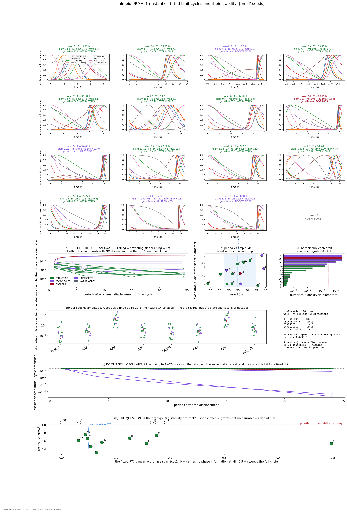
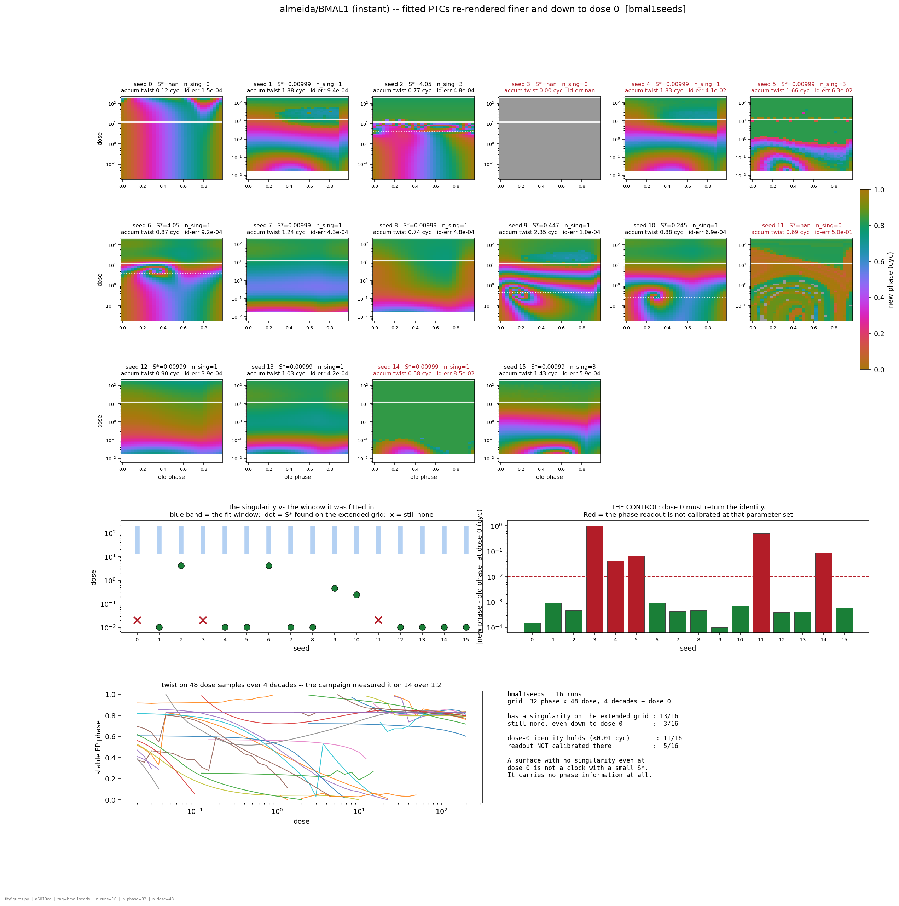

#### 5.11a The answer: the transition moved BELOW the window; it did not disappear

`fit/rescan.py` re-renders each fitted PTC at 32 phase x 48 dose over four decades, plus an
explicit dose-0 row. **13 of 16 surfaces have a phase singularity on the extended grid**, at
doses of **0.01 - 4.05** against a fit window whose floor is **12.5**. Below the window the
surfaces are full of structure -- spirals, full 0.5 phase spans -- and above it they are the
flat green sheet the campaign saw.

So the flatness is real dynamics, not a broken surface: **the fits collapsed S_crit by three to
four orders of magnitude**, which makes every dose the optimizer sampled far supercritical.
That is the mechanism behind 5.10c, now seen directly rather than inferred, and it is why
`n_sing = 0` in the fit window meant nothing about the clock.

Eight of those thirteen report `S* = 0.00999`, which is the bottom row of the extended grid --
so for them the singularity is at or below 0.01 and four decades is still not enough. The true
collapse is larger than measured.

**Three surfaces have no singularity even at dose 0**: seeds 0, 3 and 11. Seed 3 is the dead
clock, seed 11 decays to a fixed point (5.11c), and seed 0 is the one that already failed the
PTC quality gate.

#### 5.11b The dose-0 row is a control, and five runs fail it

At dose 0 the perturbation is zero, so new phase MUST equal old phase -- `engine.ptc`
calibrates the origin there. Measured deviation:

    calibrated  (11/16)   1.0e-04 - 9.4e-04 cyc     the Fourier readout's own resolution
    NOT         ( 5/16)   4.1e-02 - 5.0e-01 cyc     seeds 3, 4, 5, 11, 14

Two orders clear, so the threshold is not a judgement call. And the five that fail are **the
same five the stability audit flags** (5.11c) -- which is the useful part: a cheap, one-row
check on a surface predicts the expensive dynamical verdict. Where it fails, nothing else on
that surface is a measurement.

#### 5.11c The stability guard: 10 of 16 orbits actually attract

`fit/stability.py`. A converged BVP says `phi_T(y0) = y0` to machine precision and says nothing
about whether a trajectory ever goes there; an attracting cycle, a repelling one, and a cycle
coexisting with a stable fixed point that wins all look identical over one period. So the guard
integrates instead of doing linear algebra: displace off the cycle, walk 24 periods in
one-period blocks, and watch the transverse distance, the amplitude and `|rhs|`.

| verdict | n | which |
|---|---|---|
| **ATTRACTING** | **10** | growth 0.31 - 0.76 per period |
| DECAYS TO FIXED POINT | 2 | seeds 1, 11 -- amplitude to 1e-20 of the cycle's, `\|rhs\|` to 1e-21 |
| DIVERGES | 1 | seed 14 -- 10.3 cycle diameters out |
| UNRESOLVED | 2 | seeds 4, 5 -- see 5.11d |
| NOT AN ORBIT | 1 | seed 3 |

**Restricted to the 12 the campaign called usable: 9 attract**, seed 11 decays to a point, seed
14 diverges, seed 5 is unmeasurable. So the answer to "is the flat type-0 healthy" is *mostly
yes, and specifically not for three of them*.

Seeds 1 and 11 are exactly the failure mode this was run to look for: a solved orbit that is
real, plotted, circadian and positive, which the system nonetheless abandons for a fixed point.
The cycle panels alone cannot show it; panel (g) of the cycles figure -- amplitude over 24
periods, diving to 1e-20 -- can.

**Flatness and instability turn out to be largely independent** (cycles figure, panel h). The
flattest surfaces include both healthy attractors (seeds 2, 7, 13, 15: span < 0.05, growth
0.31 - 0.76) and the diverging seed 14. The one surface with a full 0.5 span, seed 0, attracts
at 0.539. A flat PTC is therefore not a stability diagnosis, and neither is a structured one --
they have to be measured separately, which is why there are now two drivers rather than one.

#### 5.11d THREE MEASUREMENT BUGS, AND THE FIRST TWO REVERSED THE ANSWER

Recorded because the first version of this audit reported **10 of 16 REPELLING** -- the
opposite conclusion -- and every step of it looked reasonable.

1. **`fit.cost.make_growth_fn`'s default `eps = 1e-4` sits below many orbits' numerical floor.**
   Walk from `y0` with NO perturbation at all: the trajectory starts exactly on the cycle, so
   whatever distance it accumulates is pure integration error. That floor is **8e-9** of the
   cycle diameter at the base point and **7.6e-2** at the seed-5 optimum -- seven orders apart,
   same integrator, same tolerances. Below it, "growth" is the ratio of two noise measurements.

   The tell is that it is not eps-independent, which a dynamical quantity must be:

        eps            1e-4    1e-3    1e-2    3e-2    1e-1
        base           0.857   0.857   0.871   0.824   0.695     <- a plateau: real
        seed 4         1.714   1.431   1.127   0.968   0.839     <- no plateau: noise
        PER optimum    1.386   1.063   0.808   0.729   0.659     <- no plateau: noise

   `measure()` now walks the floor first, climbs an epsilon ladder until the perturbation
   clears it by 30x, and returns UNRESOLVED rather than a number when no rung does. That is
   what seeds 4 and 5 are: not unstable, unmeasurable.

2. **Distance was measured to the cycle's VERTICES, not its segments.** The reference cycle is a
   polyline, so vertex distance cannot fall below half a sample spacing -- 5e-4 diameters even
   at 2048 points. A decaying deviation stops decaying there, and a fit through the flat tail
   returned **0.727 for an orbit whose Floquet multiplier is 0.546**. `_dist_to_cycle` now
   measures to the segments, and the fit is capped at the leading two decades.

3. And a third, which produced no wrong number only because it failed loudly: **the
   gauge-quotient basis is not reproducible** -- see 5.11e.

**The guard is now cross-checked where it can be.** `--selftest` asserts the walk recovers the
base point's published Floquet multiplier: it measures **0.549 against 0.546, 0.6% apart**. The
assertion is on the VALUE, not merely on the sign, because the tail-contaminated version would
have passed a sign test. `make_growth_fn` at its default still lands on the other side of the
threshold for **6 of the 16** runs, so **`w_stab` must not be switched on until its epsilon is
fixed** -- it would penalise orbits for the integrator's error.

#### 5.11e `v` IS A MACHINE-LOCAL COORDINATE (REPO_MAP hazard 18)

`quotient_basis` takes the SVD of a PROJECTOR, whose nonzero singular values are all exactly 1
-- `[1]*16` then `[0,0]` for Almeida. Any orthonormal basis of that subspace is a valid SVD, so
LAPACK's choice is not defined by the mathematics.

Found the hard way: re-deriving the basis and evaluating the campaign's own stored `v_fit`
reconstructed parameter sets up to **3.0 decades** from the `theta_fit` in the same file, and
every rescanned surface came back uniformly dead. Nothing was wrong with the fits; the
coordinate had been read in the wrong basis.

Every run of this campaign shares one basis -- **checked, and `fit/aggregate` now RAISES if a
future one does not** -- so 5.10a's distances stand. `make_cost` gained a `basis=` argument,
`fit/rescan` pins the run's own and refuses to proceed unless `exp(z_base + B v)` reproduces
the stored `theta_fit`. **`theta_fit` is the parameter set; `v` is a search coordinate.**

Making `quotient_basis` deterministic is the real fix and has NOT been made: it would silently
change what `v` means for every stored result, which should be a deliberate commit.

### 5.12 READING THE RESCANNED SURFACES: six oddities, five mechanisms

The extended-grid surfaces (5.11) show structure the fit window hid. Each oddity below was
traced to a measured cause, and the causes are the failure catalogue that
[`docs/FIT_VALIDITY.md`](docs/FIT_VALIDITY.md) is built around.

**No clean type-1 even extended down (all but seeds 0, 2, 6, 9, 10).** Range, not depth. For
eight seeds the extended grid's own floor sits at exactly **2.00 x their S\***, so only ONE
dose row has winding 1 and their reported `S_crit = 0.00999` is the bottom row, an edge
artefact. Four decades is not enough; their transition is genuinely below 0.02.

**A sharp discontinuity at old phase ~0.9 (seeds 1, 4).** The old-phase axis does not resolve
the cycle. Those fits are strongly relaxation-like -- **47% of the cycle's arc length lies
inside 10% of the phase axis**, peaking at phase 0.891 and 0.895, exactly where the
discontinuity is -- so on the 20-phase grid the fit used, **consecutive PTC columns start from
states 0.82 and 0.87 cycle diameters apart**. Adjacent columns are not neighbours in state
space, and the surface jumps between them because the underlying initial conditions do. Clean
seeds sit at 0.12-0.22.

**Seed 2: type-1, then a noisy band, then a "really flat type-0".** The flat region is not
type-0. Up to dose 8.1 the readout amplitude is `|z| = 1.00` and the winding is a clean 1; from
dose 12.1 **`|z|` collapses to 0.028-0.14 and stays there**. The perturbation has extinguished
the oscillation, and the flat green sheet is the Fourier phase of a dead clock. The noisy band
at dose 6.6-14.8 is the death transition -- which is where the impossible windings (-4, +2)
come from, the readout tumbling as the amplitude collapses. It is not a phase singularity and
not a resolution problem.

**Seed 5: "noise" around dose 10.** Same mechanism, earlier: `|z|` falls to 0.016 from dose 1.1
upward. The whole visible surface above that is dead. Seed 5 also has the campaign's worst
numerical floor (7.6e-2), so its orbit is fragile independently.

**Seed 11: circular contours that never span the colour map.** `|z| = 0.003-0.28` over the
ENTIRE grid -- nothing survives any dose. Seed 11 is one of the two runs that DECAYS TO A FIXED
POINT, and its dose-0 identity error is 0.50 cyc, so the readout is not calibrated there even
at zero perturbation. The contours are level sets of a decaying transient, which is why they
occupy a narrow phase band instead of wrapping.

**Seed 0: no singularity, needs extending UP.** Correct, and it is the only one in that
direction: rescanned four decades upward, seed 0's singularity is at **S\* = 363**, against a
fit-window ceiling of 199.8, with `|z| = 1.00` throughout. So the window fails to bracket the
transition in BOTH directions across the campaign -- eleven fits pushed it below the floor, one
pushed it above the ceiling.

#### 5.12a These are VALIDITY failures, not reward hacking

The natural reading is that the optimizer found cheap corners. Measured, it did not:

    corr(cost, fraction of cells where the clock was killed)   -0.14
    corr(cost, phase under-resolution)                         -0.17
    corr(cost, cycle diameter)                                 +0.09
    corr(cost, period)                                         +0.04

n = 15; none of these drives the cost ranking, and the three cheapest fits have healthy readout
amplitude -- one of them has the best phase resolution in the set. So for a large minority of
candidates `c_ptc` is simply computed on something that is not a PTC, and the optimizer is
neither helped nor hindered: it is handed noise and asked to minimise it.

That is why the plan is a **validity contract first, penalty terms second** -- six checks
(orbit, attractor, dose-0 calibration, phase resolution, aliveness, bracketing), none of which
mentions a model, a gene or a task. `docs/FIT_VALIDITY.md` has the contract, the thresholds and
the reasons each is a measurement rather than a preference, plus the ordering that keeps the
objective-changing edits in one commit.

One constraint worth stating here because it rules out the obvious fixes: **the grid cannot be
adapted per candidate.** It is the experiment. Two candidates scored on different grids have
incomparable costs -- the same objection that made the target pinned rather than re-profiled
(5.4c). So the window must be COMMISSIONED once, wide enough to bracket everything the search
can reach, and a candidate whose transition leaves it must be penalised rather than re-gridded.
For the same reason the old-phase axis stays uniform in phase: it is *when the pulse was
applied*, so F3 is a resolution requirement, never a reparametrisation.

## 5b. Next

**Reordered by 5.10.** The top three now all come from the cluster campaigns, and they are
about the OBJECTIVE, not about the search: the searches worked, and what they optimised turned
out not to be what was wanted.

0. **THE SURFACE VALIDITY CONTRACT comes first** -- [`docs/FIT_VALIDITY.md`](docs/FIT_VALIDITY.md)
   has the full plan, ordered by information gained over risk of invalidating what exists. In
   brief: emit and store a per-evaluation validity vector (orbit / attractor / dose-0
   calibration / phase resolution / aliveness / bracketing) before touching the objective;
   commission the grid per (model, target, mode) rather than inheriting it; then land the
   objective-changing terms as ONE commit with ONE re-run. 5.12a is why that order and not the
   other: these are validity failures, not reward hacking, so penalty terms alone would treat
   a symptom.
1. **Fix what 5.10 exposed, before running another radialization.** In order:
   a. *Weight the cost toward the doses where the target is informative*, or cap `max_factor`
      so the window does not run 9 rows deep into the flat asymptote. As it stands two thirds
      of the cells are nearly free (5.10c, hazard 17).
   b. *Add a phase-resolution term.* A PTC that does not resolve old phase has zero twist by
      construction and currently reads RADIALIZED (5.10d). The obvious form is a floor on the
      surface's old-phase range, charged like the amplitude floor.
   c. *One line in `fit/radial._diagnose`*: `make_guess_fn`, not `solver.guess` (5.10f) -- and
      land `make_growth_fn` / `w_stab`, already written, so stability stops being read off a
      Floquet number that overflows on one run and disagrees with itself on another.
   d. *Reconcile the fixture `S_crit` with the pinned singularity*, which disagree by up to
      4.7x and anchor the window and the target to different doses (5.10e).
   Only (c) is free; (a), (b) and (d) all change the objective, so the 20 completed runs are a
   BASELINE against the current cost rather than results to build on.
2. **Map recovery against displacement.** T1 is done at eps = 0.3 (fails) and eps = 0 (passes).
   The distance at which it breaks is the quantitative version of "from-distance locality",
   which was never measured on Mirsky, and `fit/recover.py --eps` sweeps it directly. 5.10b
   adds a data point from the other direction: 16 starts at `|v| = 4.2 - 7.7` all did WORSE
   than one start from nominal.
2. **Do genes carry independent information?** Rank of stacked multi-gene PTC jacobians. On
   Mirsky the lesson was "vary dose, not gene", but dose variation is already ruled out here
   (5.1), so if Almeida's genes are non-redundant the two models differ in a way that changes
   experimental design.
3. **T2, basin structure** -- multistart clustered in quotient coordinates. Note the from-truth
   control means any cluster found is about reachability, not about the cost having many
   minima.
4. ~~**T3 (radial fit) stays parked**~~ -- **RUN**, on the cluster, 20 searches. See 5.10. It was
   worth running: it did not answer the radialization question, but it exposed three things
   about the objective that no amount of parking would have (hazard 17, the phaseless PTC, and
   the diagnostic bug). The next T3 should wait for item 0.
4. **Run (a) and (b) for Korencic and Goldbeter.** The complexity ladder 11 -> 18 -> 34 -> 52 ->
   (132) makes "identifiability vs model size" measurable rather than anecdotal. Re-derive, do
   not inherit, every scale-bearing constant.
5. **Re-test the "same decoupled direction" claim** (3.7) now that it rests on two clean probes
   rather than four.
6. **Reduce the 34 non-converged LC settings** -- better orbit continuation, or a
   predictor-corrector along the factor grid.

---

## 6. Figures

### Where they live

`out/<model>/<analysis>/<tag>/<name>.png`, next to the npz that produced them -- **not** in one
flat folder. Each carries a `.png.meta.json` sidecar (entry script, git commit, host, time, and
the config that produced it) and a footer stamp inside the image, so a PNG pasted into a slide
is still traceable to its run. Re-running an analysis with different settings writes a
distinguishable batch instead of silently overwriting.

`docs/figures/` holds only the curated copies this document cites, promoted explicitly with
`--publish` and prefixed by model name. Regenerate everything with:

```bash
python -m analysis.figures --model almeida --target BMAL1 --tag batch1 --publish
```

A CAMPAIGN's figures need its tasks joined first -- the comparison they draw does not exist
until then:

```bash
python -m fit.aggregate --model almeida --tag bmal1seeds          # then --which seeds
python -m fit.figures   --model almeida --which seeds --tag bmal1seeds
```

Pure read of the saved npz -- no figure costs compute to rebuild.

### What each one answers

| figure | what it answers |
|---|---|
| `scrit_pulse` | winding vs dose per target; where each changes type, and where the numerics stop being trustworthy (shaded) |
| `surfaces_pulse` | the base PTC surfaces, each with its twist curve in a panel below |
| `tornado_BMAL1_pulse` | LC and PTC sensitivity per parameter on a shared ordering, plus their ratio |
| `lc_examples` | what an LC sensitivity number looks like as an actual cycle change |
| `ptc_examples_BMAL1_pulse` | the same for the PTC, with the Delta new-phase panel |
| `directions_BMAL1_pulse` | the combinatorial decoupling: spectrum, parameters vs directions, loadings |
| `direction_examples_BMAL1_pulse` | one nudge, shown in the LC and in the PTC side by side |
| `sweep_BMAL1_pulse_<direction>` | a RANGE of nudges along one direction, with the PTC features tracked along it |
| `radial_<gene>_<mode>_<opt>` | ONE fit: target / base / fitted PTC, both difference maps, both limit cycles in real time, the twist, the numbers |
| `seeds_<gene>_<mode>` | a SEED CAMPAIGN: cost ranking, the cost-vs-distance funnel (the multimodality test), the pairwise distance matrix, descent traces, twist, **the residual split by dose**, and where the solutions agree in parameter space |
| `seeds_<gene>_<mode>_surfaces` | every fitted PTC in that campaign beside the base and the target -- whether the far-apart parameter sets are also far-apart phase responses |
| `genes_<mode>` | a GENE campaign: base / target / fitted PTC and the twist per gene, each on its OWN dose axis, with how much structure that gene's target actually had |
| `cycles_<gene>_<mode>` | every fitted LIMIT CYCLE with its period and amplitude, plus the stability walk: step off the orbit and watch whether it comes back, runs away, or settles on a point |
| `rescan_<gene>_<mode>` | the fitted PTCs re-rendered finer and down to DOSE 0 -- where the singularity really went, and the dose-0 identity control |

### Reading a PTC surface

On a **PTC surface**: x is old phase, y is dose (log), colour is new phase; the dashed white
line is `S_crit` and the white dot is the phase singularity.

On a **twist panel**: x is dose (log), y is the stable fixed-point phase wrapped to [0, 1],
with dotted guides at 0 and 1, a vertical guide at `S_crit` and a dot where the curve crosses
it. This is the input_screen house orientation (`plot_twist_movers`), and 0/1 wraps are handled
by breaking the line with NaN rather than by unwrapping -- keeping the phase axis literal so a
value can be read straight off it. Note the two panel types therefore do NOT share an axis.

**The fixed-point curve is no longer drawn over the surface.** A line across a cyclic colour
field is hard to read and competes with the surface it annotates.

## 7. Glossary

- **PTC** — phase transition curve: new asymptotic phase vs old phase, as a function of dose.
- **Type-1 / type-0** — weak (winding 1) vs strong (winding 0) resetting. The transition passes
  through a **phase singularity** where the perturbed state is phaseless.
- **S\***, **phi\*** — dose and old-phase of the singularity. Topological defects: discontinuous
  and grid-quantised.
- **Twist** — how the isochrons shear with distance from the cycle, measured as the stable
  fixed point's phase vs dose. Smooth and gauge-invariant; radial isochrons give zero twist.
- **Floquet multiplier** — the factor by which an off-cycle perturbation shrinks per period.
  Sets how long you must wait before an "asymptotic" phase reading is actually asymptotic.
- **Gauge** — the exact unit-rescaling symmetry of the parameters. Flat for any observable
  that does not fix the concentration units.
