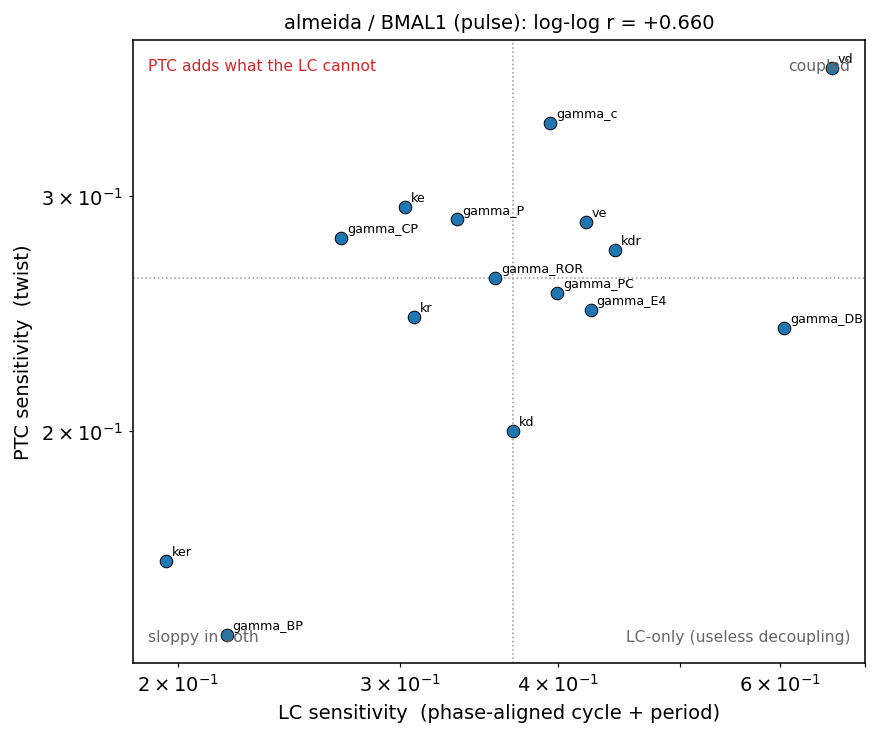

# `clock_zoo` — LC vs PTC identifiability across simpler clock models

*Semi-README scientific reference. Update it with every result. Figures live in
`docs/figures/`, copied out of the git-ignored `out/`, so they travel with this document.*

---

## 0. TL;DR

**Question (unchanged from `../input_screen/`).** Does phase-transition-curve (PTC) data make a
mechanistic circadian model more identifiable than limit-cycle (LC) data alone?

**Why a new repo.** Three weeks on **Mirsky 2009** (21 states, 132 params) established the
machinery and several robust phenomenological results, but the optimisation never worked:
gradient descent recovers 132/132 parameters *from the truth* and stalls at ~26/132 *from a
distance*. That "from-distance locality" blocked the actual scientific question. So: change
the model, not the optimizer, and re-ask it on models small enough to optimise.

**Status.** The stack is built and gated. Objective (a) is answered for Almeida; (b) is in
progress. The most consequential findings so far are methodological, and each one changed a
scientific answer:

- **Almeida's PTC type-transition dose is a property of the integrator step until you refine
  it.** At `dt=0.02`, 3 of 8 targets appeared to reset; refined, **7 of 8 do**.
- **A converged periodic-orbit solve is not necessarily a limit cycle.** Equilibria and
  negative-orthant runaways both satisfy the BVP, and both produced spectacular-looking
  "sensitivities" (5e98, 1e11) before being caught.
- **Almeida is far less gauge-degenerate than Mirsky** — 2 flat directions of 18, versus 13 of
  132 — so its identifiability question is essentially unconfounded by units.

---

## 1. The models

All three were taken from `../circadian_modeling.ipynb`, ported unchanged (verified against
the notebook's own `derivatives`), and all oscillate self-sustainedly at their published
parameters, so **no re-fit was needed** before characterization.

| model | states | params | period | structure | Floquet mu | gauge |
|---|---|---|---|---|---|---|
| **Goodwin/Gonze** | 3 | 11 | 23.540 h | single negative loop, Michaelian degradation | 0.951 | 4 |
| **Almeida 2020** | 8 | 18 | 24.826 h | transcription-factor level; EBOX/RRE/DBOX; one reversible complex | 0.546 | 2 |
| **Korencic/Grabe** | 15 | 34 | 25.809 h | 5 genes x a 3-stage delay chain; no complexes | 0.505 | 1 |
| **Leloup–Goldbeter 2003** | 16 | 52 | 23.849 h | phosphorylation + nuclear transport + MM degradation | 0.334 | 5 |
| *(Mirsky 2009, for scale)* | *21* | *132* | *23.7 h* | *mass-action dimers* | — | *13* |

Goodwin is a **smoke test, not a science target**: it is the smallest thing that oscillates and
its gauge is known-good from `input_screen`, so it validates every tool before that tool
touches a model whose answer we do not already know.

**Four Goldbeter parameters were dropped.** `V1PCP`, `V1BP`, `V2PCP`, `V2BP` appear in the
notebook's parameter dict but in none of its 16 equations — verified numerically: perturbing
each leaves the RHS bit-identical. Keeping them would contribute four guaranteed-flat
directions to every identifiability count, inflating precisely the quantity being measured.

### 1.1 The perturbation

Two generic modes, defined for any state of any model: **pulse** (an additive production rate
`+dose` for 8 h, then off) and **instant** (a one-shot displacement, clamped at 0). No ectopic
protein, no degron, no complex bookkeeping. This is the notebook's own
`AdditiveRatePerturbation`, so PRCs stay comparable with what is already there, and it is the
only definition that maps onto Korencic, which has no protein species at all.

---

## 2. The gauge: how much of each model is even meaningful

Rescaling a species — measuring it in different units — is an exact symmetry absorbed into the
parameters, so any observable that does not fix the concentration units is blind to it. The
generators are **derived** from each model's declared dimensions and then **verified**, not
asserted: the defining identity `f(S y; theta_gauged) = rho . S . f(y; theta)` is checked
pointwise, with no integration to hide behind.

| model | generators | of params | physically meaningful | identity |
|---|---|---|---|---|
| almeida | 2 | 18 | **16** | 1.3e-13 |
| korencic | 1 | 34 | **33** | 6.3e-15 |
| goldbeter | 5 | 52 | **47** | 1.6e-15 |
| goodwin | 4 | 11 | 7 | 3.6e-16 |

**Almeida's 2 generators are forced by its shared promoter terms.** `EBOX` is added to five
different species' equations, `RRE` to four, and the PER/CRY binding and BMAL1 titration terms
chain the rest — so *all eight species share one concentration unit*, leaving one scale factor
plus time. There is no per-species freedom at all.

**Korencic needed a new piece of contract.** Its transcription is a bare product of Hill
factors with **no maximal-rate parameter**, so nothing can absorb a rescaling of a transcript.
That is not expressible as "these species share a unit", so `models/api.py` gained
`scale_constraints()`: linear relations the log scales must satisfy. Korencic declares three
per gene, which pin every species scale to the single time rescale (its derived factors come
out as exactly `rho^-1, rho^-2, rho^-3` along each chain). **One generator for 34 parameters.**

The practical consequence: unlike Mirsky, these models' identifiability questions are almost
entirely unconfounded by units — but the gauge must still be projected out before any
parameter-space comparison, because a gauge direction is exactly LC-null while moving a
fixed-absolute-dose PTC, which is precisely the false signal `analysis/coupling.py` hunts for.

---

## 3. Results

### 3.1 Objective (a): which components reset the clock, and where

`analysis/scrit.py`, Almeida, pulse mode. **S_crit is the dose of the type-1 → type-0 winding
transition.** This is the canonical table — do not recompute it.

| target | S_crit | dt-converged | re-entrant | valid to | dt needed |
|---|---|---|---|---|---|
| DBP | **0.196** | yes | yes | 1e4 | 0.005 |
| BMAL1 | **3.16** | yes | no | 22.1 (unstable) | 0.005 |
| PER_CRY | **5.51** | yes | no | 117 (unstable) | 0.00125 |
| PER | **16.8** | yes | no | 1e4 | 0.00125 |
| CRY | **29.2** | yes | yes | 1e4 | 0.00125 |
| REV | **29.2** | yes | yes | 1e4 | 0.00125 |
| E4BP4 | **50.9** | yes | no | 1e4 | 0.00125 |
| ROR | — | — | — | 1e4 | 0.005 |

**Seven of eight Almeida targets reset.** ROR is the sole non-resetter, and credibly so: it
was scanned to the top of the range (1e4) without the integrator going unstable, so this is a
statement about the model rather than about where the numerics gave up.

> **This table required refining `dt`, and that changed the answer.** The dose at which
> fixed-step RK4 goes unstable is a property of the STEP, not the model, and it moves ~8x per
> 4x smaller step. At `dt=0.02` the ceiling for CRY is 6.2 and CRY appears not to reset at
> all; at `dt=0.005` the ceiling is 48.6 and CRY resets at 32.2; `dt=0.00125` confirms 32.2.
> A single default step would have produced the clean, plausible, **wrong** claim that 5 of
> Almeida's 8 targets are non-resetting.

**Contrast with Mirsky.** There the rule was sharp and structural: only the repressor arm
resets; BMAL1/CLK/RORa are dose-flat with no singularity even at 500x peak. Almeida shows no
such arm asymmetry — BMAL1 is among its *strongest* resetters (S_crit 3.16). Whether that is a
real difference in clock architecture or a consequence of Almeida's single shared scale group
is an open question, and Korencic/Goldbeter are the next data points.

### 3.2 The base PTC surfaces

`analysis/characterize.py` on the adaptive grids.

| target | S* | phi* | total twist | singularities | min rel. amplitude |
|---|---|---|---|---|---|
| DBP | 0.452 | 0.771 | **0.424 cyc** | 1 | 1.000 |
| BMAL1 | 4.503 | 0.521 | **0.489 cyc** | 1 | 1.000 |
| PER | 15.65 | 0.854 | **0.159 cyc** | 1 | 1.000 |

Each surface shows exactly **one** dipole-filtered singularity — a clean type-1 → type-0
transition, textbook pinwheel structure, the S_crit line passing through the defect. Two
things worth noting:

- **The clock is never even weakened** (minimum relative amplitude 1.000 across every grid
  point). Almeida's oscillation is robust to these perturbations in a way Goodwin's is not —
  an 8 h pulse of dose 0.5 into Goodwin's X drives Z high enough that its n=4 Hill shuts
  transcription down ~1e-5 and the oscillator stops **permanently**.
- **Isochron twist is substantial** — 0.42–0.49 cyc for DBP and BMAL1, i.e. the entrainment
  phase shears by nearly half a cycle across the dose range. Twist is the smooth,
  gauge-invariant feature and is what any isochron claim should be read from; `S*`/`phi*` are
  topological defects and are grid-quantised.

*(S* here is 4.503 for BMAL1 against `scrit`'s 3.16 — the two use different dose grids, so
this is grid resolution, not a discrepancy.)*

### 3.3 Objective (b), part 1: LC sensitivity

`analysis/lc_sens.py`, Almeida, 18 parameters x 9 factors (x0.25 – x4).

Top movers: `vd` 0.659, `vr` 0.605, `gamma_DB` 0.604, `gamma_REV` 0.589, `krr` 0.462.
Least: `ker` 0.196, `gamma_BP` 0.219, `gamma_CP` 0.269.

**The striking feature is the RANGE: 0.20 to 0.66, a factor of 3.3.** For Mirsky the
equivalent span was ~50x, with a long sloppy tail. Almeida has **no sloppy parameters in the
single-parameter sense** — every one of its 18 parameters moves the limit cycle by a
comparable amount. That is a genuinely favourable property for identifiability and a direct
consequence of choosing a small model.

*Caveat, stated plainly:* 51 of 162 settings were rejected (6 dead, 11 negative-orthant, 34
non-converged). The rejections concentrate at large displacements, so the reported spans are
mild **under**-estimates. The 34 non-converged are a known limitation of the orbit guess, not
a claim that no orbit exists there.

### 3.4 Objective (b), parts 2–3: PTC sensitivity and the coupling

`analysis/ptc_sens.py` on Almeida / BMAL1 (pulse), 18 parameters x 9 factors on the fixed base
dose grid 0.912–22.1. Ranked by twist response: `vd` 0.375, `gamma_c` 0.340, `vr` 0.321,
`ke` 0.295, `gamma_P` 0.288. As with the LC, the range is narrow — 0.24 to 0.37.

`analysis/coupling.py`, the gauge quotiented out (2 of 15 usable parameters), J_LC = 513
observables x 15 parameters, J_PTC = 576 x 15.

**Preliminary, and it points the opposite way to Mirsky — but read the caveats.**

| | Mirsky (input_screen) | Almeida (here) |
|---|---|---|
| per-parameter log-log correlation | tight | **+0.660** (moderate) |
| the low-LC / high-PTC quadrant | **empty** | 4 of 18 parameters |
| angle between the single best-determined LC and PTC combination | — | **79.1 deg** |
| LC-sloppiest directions' share of PTC response | 3.4% (pointwise) / 0.5% (twist) | **7.7%** |

The clearest signal is the **79.1 deg** between the leading LC direction and the leading PTC
direction: the combination the limit cycle pins hardest and the one the PTC pins hardest are
nearly orthogonal. The next few are more shared (k=3: 14, 39, 84 deg; k=5: 9, 22, 45, 77, 81),
so the two experiments overlap substantially but each retains directions the other is close to
blind to. Consistently, the PTC response is **not monotone in LC sensitivity** — the 2nd LC
direction carries the largest PTC response (1.000) while the 1st carries 0.375.

**What this does not yet establish.** Three things, stated plainly:

1. **The quadrant count is weak evidence.** Every parameter sits within a ~3x band on both
   axes (see the figure), so the quadrant split is a median cut through a tight cluster, not
   an order-of-magnitude separation like Mirsky's. "4 in the prize quadrant" should not be
   read as "4 decoupled parameters".
2. **The candidate directions are unconfirmed.** Directions 9, 10 and 12 (LC sigma 0.015–0.064,
   PTC response 0.18–0.25, dominated by `gamma_BP`/`ke`/`gamma_CP`/`kd`/`ker`) are the
   shortlist. A finite displacement along each must be pushed through the independent adaptive
   engine before any of it is cited. In `input_screen` the jacobian-derived version of exactly
   this claim was wrong by ~80 orders of magnitude and only the finite-displacement evidence
   survived.
3. **3 of 18 parameters were dropped**, lacking a converged orbit at both difference factors.

**One thing that IS solid**: after the gauge projection, the two exactly-null directions of
J_LC are also exactly null in J_PTC (3.5e-16). That is the correct, self-consistent behaviour
and confirms the projection is doing what it should rather than leaking a false signal.

---

## 4. Method notes that changed an answer

Each of these was found by an independent cross-check, not by inspection, and each had already
produced a plausible-looking wrong number.

1. **A small BVP residual does not mean you have a limit cycle.** `phi_T(y0) - y0 = 0` holds at
   any equilibrium for any `T`, and the phase condition `f(y0)[ref] = 0` holds there too
   because the whole field vanishes. Almeida at `vr x4`: residual ~1e-15, `T = 4.6e5 h`, and
   an "LC sensitivity" of **5e98**.
2. **Negative-orthant runaways do too.** The models clamp the state at 0 inside the RHS, which
   makes the field degenerate for negative states, so a linear runaway closes on itself. At
   `krr x2`: a "cycle" reaching **-2.6e12** that passed both the amplitude and period tests
   and read as a sensitivity of 1e11.
3. **Continue through the relaxation, not into Newton.** Almeida admits a **stable equilibrium
   alongside its limit cycle**, and undamped Newton handed the previous solution jumps into
   it: `vr x1.26`, one step from base, was reported "dead" while an LSODA relaxation shows a
   healthy oscillation of relative amplitude 6.8. Of 8 sampled rejections, **7 genuinely
   oscillated**.
4. **The transient skip must come from the Floquet multiplier.** There is no safe constant.
   Almeida (mu = 0.546) needs 12 periods for a transient to fall to 1e-3; Goodwin (mu = 0.951)
   needs **138**. A fixed 6 leaves 2.6% of Almeida's transient and 74% of Goodwin's — and with
   the two PTC engines skipping different amounts they disagreed by 0.33 cyc while each looked
   perfectly plausible alone.
5. **The Fourier window must span an integer number of TRUE periods.** Windowing on the
   nominal period leaks harmonics into the fundamental and biases the phase, so the dose-0 PTC
   stops being the identity: Goodwin (nominal 24.0 vs true 23.540) was off by 3.6e-3 cyc, 93x
   worse than after the fix.
6. **A phase is only meaningful if there is an oscillation.** `arg` of a near-zero Fourier
   coefficient is noise, and the phase readout returns it without complaint — reporting a
   confident type-0 PTC for a Goodwin clock that had stopped permanently.

### 4.1 Validation status

`python -m engine.validate` — eight checks, all four models PASS:

| check | Almeida | Korencic | Goldbeter | Goodwin |
|---|---|---|---|---|
| jax RHS vs numpy RHS | 0 | 4.5e-16 | 0 | 0 |
| orbit residual | 1.3e-13 | 8.7e-15 | 5.8e-15 | 7.8e-16 |
| period vs adaptive relaxation | 2.8e-09 | 1.3e-11 | 1.5e-10 | 5.1e-11 |
| 8x self-convergence | 2.9e-09 | 1.3e-11 | 4.4e-11 | 6.7e-12 |
| gauge identity | 1.3e-13 | 6.3e-15 | 1.6e-15 | 3.6e-16 |
| gauge covariance of the orbit | 1.4e-14 | 3.9e-15 | 2.6e-15 | 1.5e-14 |
| **two PTC engines agree** | **1.6e-05** | **7.8e-04** | — | **2.6e-04** |

The last row is the one that matters: `engine/ptc.py` (JAX, fixed-step RK4, Fourier phase)
against `engine/reference.py` (scipy LSODA, peak-matching phase) — no shared numerical
machinery, **no offset fitting**, and agreement required on which cells are dead as well as on
the live phases.

---

## 5. Next

1. **Confirm the Almeida coupling candidates** (§3.4, directions 9/10/12) by finite
   displacement on `engine/reference.py`. This is the single highest-value next step: it turns
   a suggestive 79 deg into either a real result or a retracted one.
2. **Run (a) and (b) for Korencic and Goldbeter.** The framework needs no changes; the
   complexity ladder 11 → 18 → 34 → 52 → (132) makes "identifiability vs model size" a
   measurable axis rather than an anecdote.
3. **Confirm any decoupled direction by finite displacement** on the adaptive engine before
   citing it. This is not optional: in `input_screen` the autodiff version of exactly this
   claim was wrong by ~80 orders of magnitude, and only the finite-displacement evidence
   survived.
4. **Reduce the 34 non-converged LC settings** — better orbit continuation, or a
   predictor–corrector along the factor grid.
6. **Then batch 2: optimisation.** Are there multiple distinct basins? Can PTC data constrain
   globally what LC data cannot? That is the question the model switch was made to reach, and
   it is now approachable because these models are 18–52 parameters rather than 132.

---

## 6. Glossary

- **PTC** — phase transition curve: new asymptotic phase vs old phase, as a function of dose.
- **Type-1 / type-0** — weak (winding 1) vs strong (winding 0) resetting. The transition passes
  through a **phase singularity** where the perturbed state is phaseless.
- **S\***, **phi\*** — dose and old-phase of the singularity. Topological defects: discontinuous
  and grid-quantised.
- **Twist** — how the isochrons shear with distance from the cycle, measured as the stable
  fixed point's phase vs dose. Smooth and gauge-invariant; radial isochrons give zero twist.
- **Floquet multiplier** — the factor by which an off-cycle perturbation shrinks per period.
  Sets how long you must wait before an "asymptotic" phase reading is actually asymptotic.
- **Gauge** — the exact unit-rescaling symmetry of the parameters. Flat for any observable
  that does not fix the concentration units.
